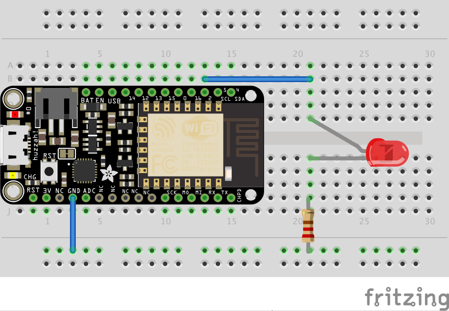
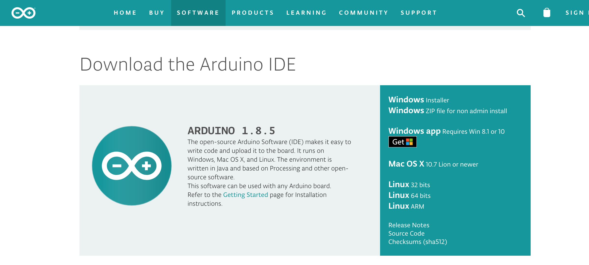

# Experiment 1: Blink an LED Light[1](#myfootnote1)
## Introduction
LEDs (light-emitting diodes) are small, powerful lights that are used in many different applications. To start off our experiments with the ESP8266, we will work on blinking an LED using a digital output.  This experiment will also walk you through coding uploading your first sketch with the Arduino IDE.

Parts Needed
You will need the following parts:

* 1x LED (Choose any color)
* 1x 560Ω Resistor
* 2x Jumper Wires

## Hardware Hookup
Ready to party? Components like resistors need to have their legs bent into 90° angles in order to correctly fit the breadboard sockets. You can also cut the legs shorter to make them easier to work with on the breadboard.

Pay close attention to the LED. The negative side of the LED is the short leg, marked with a flat edge.

Each experiment will have a Fritzing hook-up diagram. Connect the components to the breadboard and Photon RedBoard by following the Fritzing diagram below:

Having a hard time seeing the circuit? Click on the Fritzing diagram to see a bigger image.

All jumper wires work the same. They are used to connect two points together. All the experiments will show the wires with different colored insulations for clarity, but using different combinations of colors is completely acceptable.

Be sure to the polarity on the LED is correct. The longer lead should be connected to D0. You will need to slightly bend the longer leg so that both are the same length when placed int he breadboard.

## Installing the software

Download and install the Arduino IDE Software from [https://www.arduino.cc/en/Main/Software](https://www.arduino.cc/en/Main/Software)

Now you need to install an Ardiuno IDE add-on that enables us to use our processor boards. The instructions are [here](https://learn.adafruit.com/adafruit-feather-huzzah-esp8266/pinouts?view=all#using-arduino-ide)

## Write the program to blink the LED light.
Open up the Arduino IDE (the program you just installed in the step above). Then, under the file menu select **New** and type in the following program

	/*
    Our First Blink an LED program
    */
     
    // setup runs exactly once
    void setup() {
       pinMode(2, OUTPUT);     // Initialize the pin 2 as an output pin
    }

    // the loop function runs over and over again forever
    void loop() {
        digitalWrite(2, HIGH);          // turn on the LED connected to pin 2
        delay(1000);                    // Wait for a second
        digitalWrite(2, LOW);           // turn off the LED
        delay(1000);                     // Wait for one second
    }

Next, under the Tools menu under the **Board** submenu select **Adafruit HUZZAH esp8266**.**

Then, check your program by clicking on the checkmark icon

The check is optional. It just checks your program for syntax errors. Next you can upload your program to your board by clicking on the arrow icon:

You now should have a blinking LED light.

<a name="myfootnote1">1</a>: Tutorials are [CC BY-SA 4.0](https://creativecommons.org/licenses/by-sa/4.0/). Original page at [Sparkfun Inventor's Kit for Photon](https://learn.sparkfun.com/tutorials/sparkfun-inventors-kit-for-photon-experiment-guide/experiment-1-hello-world-blink-an-led).  This slight remix by Ron Zacharski
