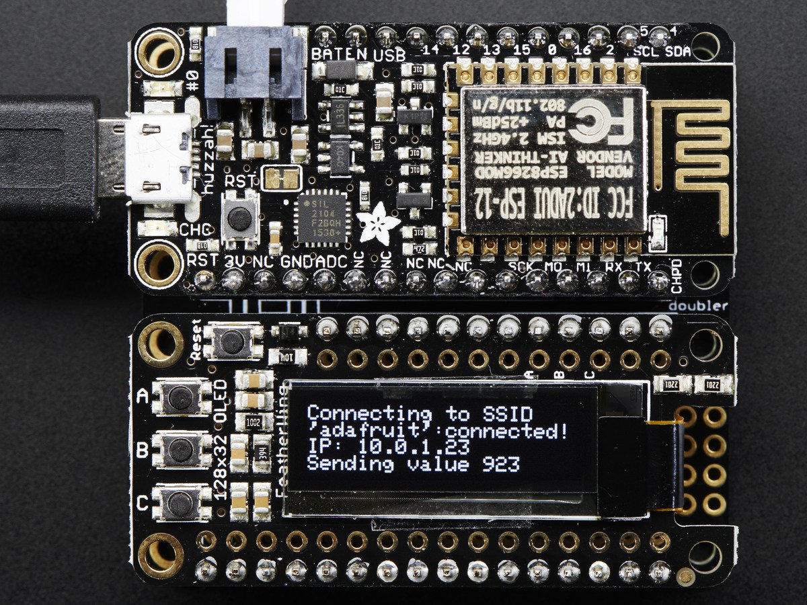
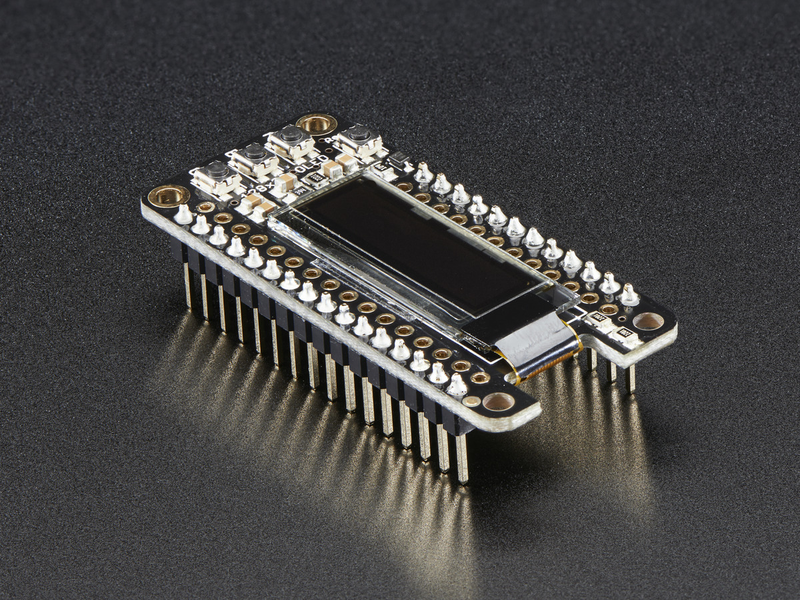
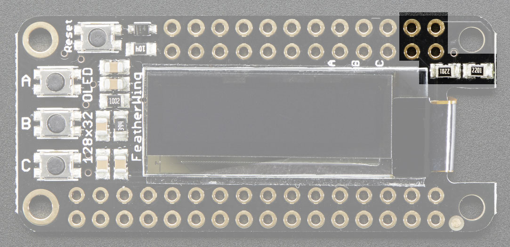
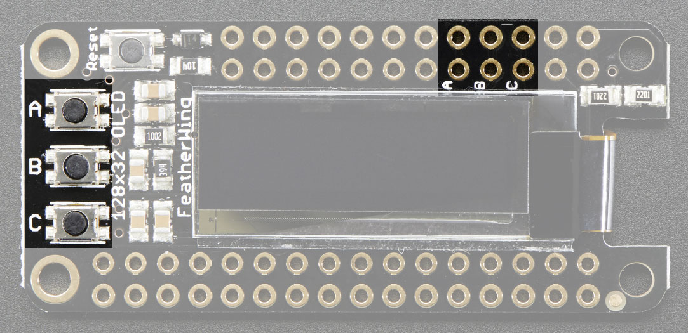
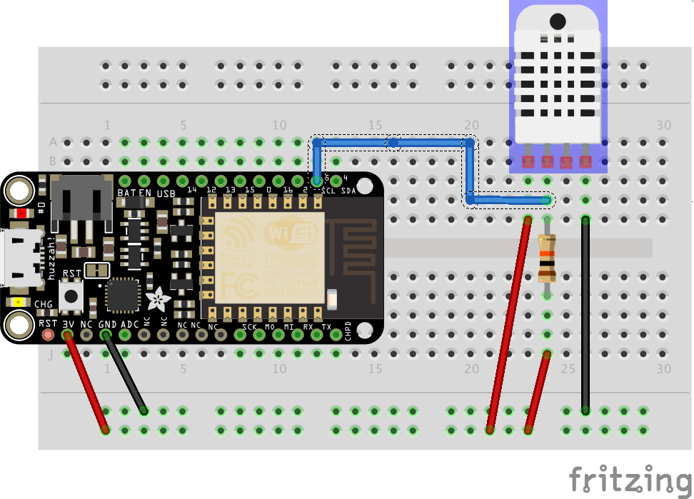

# Experiment 10: An OLED LCD display[1](#myfootnote1) 140xp

### Point Summary

* Basics 10xp
* Alleviating End of Semester Stress 10-20xp
* Liberal Arts - 5xp
* Be Be Happy - 15-25xp
* Temperature and Humidity - 20xp
* Sunny Cloudy - 15xp
* Magic 8 Ball 20xp
* Magic 8 Text 15xp
* Too Hot Text - 20xp

Since the start of class we've been working with LEDs. LED stands for Light Emitting Diode.
In this experiment we are going to work with an OLED display. OLED stands for **Organic Light Emitting Diode**.  

 
Unless otherwise noted all images are under the Attribution-ShareAlike Creative Commons license by Adafruit.

## The hard part
The hardest part of this lab might be soldering on the headers onto the feather board. If you need help soldering let us know.

ture](pics/neopixelSmall_bb.png)

## Step 1 The Basic Code

### Installing the library.
First you need to download the library at [Download Adafruit_FeatherOLED from github](https://github.com/adafruit/Adafruit_FeatherOLED/archive/master.zip). Unzip the file you download and move the resulting folder to your Arduino/libraries folder.

### The basic code 10xp
Here is the code:

    // Simple OLED
    //
    // Adafruit invests time and resources providing this open source code.
    // Please support Adafruit and open source hardware by purchasing
    // products from Adafruit!
    //
    // Written by Todd Treece for Adafruit Industries
    // Copyright (c) 2016 Adafruit Industries
    // Licensed under the MIT license.
    //
    // All text above must be included in any redistribution.

    #include <Wire.h>
    #include <Adafruit_GFX.h>
    #include <Adafruit_SSD1306.h>
    #include <Adafruit_FeatherOLED.h>

    Adafruit_FeatherOLED oled = Adafruit_FeatherOLED();

    // integer variable to hold current counter value
    int count = 0;
    int down = 10000;
    void setup()
    {
      Serial.begin(115200);

      oled.init();
    }

    void loop()
    {

      // clear the current count
      oled.clearDisplay();
      oled.setCursor(0,0);

      // print the count value to the OLED
      oled.print("count: ");
      oled.println(count);
      
      // move 10 pixels down
      oled.setCursor(0,10);
      oled.print("Time remaining: ");
      oled.println(down);
      // update the display with the new count
      oled.display();
      
      // increment counters by 1
      count++;
      down--;
      
      // delay 1 second 
      delay(1000);
    }

# Remix - Alleviating End of Semester Stress - up to 20xp
Just demo the completed project with all the addons you want

### basic 10xp
Can you create a device that repeatedly displays *Don't worry* for 2 seconds and then *Be Happy!* for another 2 seconds?  

### More interesting font +5xp
Can you do it in a different larger font?  You do this in two steps. First you include the library using something like `#include <Fonts/FreeSansBold9pt7b.h>`, which unsurprisingly loads a 9 point bold Sans font. Second, you set the display font using something like `oled.setFont(&FreeSansBold9pt7b);`. For a list of all the fonts see [This Adafruit page](https://learn.adafruit.com/adafruit-gfx-graphics-library/using-fonts)

### Uses the modulo % operator +5xp
Can you do the above using only one `oled.display();` line in your loop? (Since there are only two states, the *Don't worry* state and the *Be happy* state I only need to use 2 numbers, 0 and 1--that's a hint)

#  A distraction - optional 5 liberal arts xp
So I was thinking our board (the mighty esp8266 Feather Huzzah) along with the OLED feather would make a nice micro Amazon Kindle. So I wrote this code to display a book.

    #include <Wire.h>
    #include <Adafruit_GFX.h>
    #include <Adafruit_SSD1306.h>
    #include <Adafruit_FeatherOLED.h>

    Adafruit_FeatherOLED oled = Adafruit_FeatherOLED();

    // integer variable to hold current counter value
    int count = 0;
    int down = 10000;
    void setup()
    {
      Serial.begin(115200);

      oled.init();
    }

    char* story[]={"When", "I", "wrote", "the", "following", "pages,", "or", 
                   "rather", "the", "bulk", "of", "them,", "I", "lived", "alone,", "in", "the", "woods,", 
                   "a", "mile", "from", "any", "neighbor,", "in", "a", "house", "which",
                   "I", "had", "built", "myself"};
                   
    void loop()
    {

      for (int i = 0; i< 31; i++) {
        oled.clearDisplay();
        oled.setCursor(0,15);
        oled.println(story[i]);
        oled.display();
        delay(500);
      }
      delay(1000);
      
    }

Try it out! (5xp if you know the book and the author). Anyway I got tired of typing in the book.

# Remix - B B B Be Be Happy 10-20xp.
  * Can you make [this popping *Be Happy!* display](https://photos.app.goo.gl/8PemRmJW8W8dWKIv1) with fewer than 20 lines in the loop? 
* or [the augmented one](https://photos.app.goo.gl/Guqm7LVg8HCEfDf62) +5xp
* or [the super augmented one](https://photos.app.goo.gl/0UOO7fZec1UnllDK2) +5xp

# Remix Temp and Humidity - 20xp
Even though our OLED is mounted on all the pins, it actually only uses 2:

That means we can connect the usual things to our esp8266 as long as we don't use pins 4 and 5.  On the side of the OLED are three buttons which are optionally available for use. These are connected to pins 2, 16, and 0:

If we are not using those buttons we can use those pins for other things.

## Temperature sensor. 
Let's keep the OLED connected but temporarily switch to the temperature/humidity sensor included in the kit.  

It is wired up this way (again, no need to remove the OLED):

## Installing the libraries.
We need to install 2 libraries 

### The Sensor library
[Download the sensor library zip file](https://github.com/adafruit/Adafruit_Sensor/archive/master.zip), unzip it, rename the folder `Adafruit_Sensor` and move the folder to your `Arduino/libraries` folder.

### The Temperature Sensor library
[Download the temperature sensor library zip file](https://github.com/adafruit/DHT-sensor-library/archive/master.zip), unzip it, rename the folder `DHT` and move the folder to your `Arduino/libraries` folder.

## The code
When you loaded the libraries, you also installed several example programs. In the Arduino IDE, under the file menu select `examples/DHT sample library/DHTtester` You may want to change `Serial.begin(9600)` to `Serial.begin(115200)`. When you upload that program you should see in the serial monitor:

## Your task
Can you create a device that displays the temperature and humidity on the OLED display?

## Sunny or Cloudy 15xp
Can you add another sensor so that your device will also display whether it is sunny or cloudy (in addition to temperature and humidity)? [Here are some pictures using previous hardware](https://docs.google.com/document/d/1rW4axzxtlXokvxu779qp5EPRNzxiRd9hQWBRCiOuPUQ/edit)

# Magic Eight Ball 20xp
Remember those Magic Eight Balls?

If not, check out [this Wikipedia page](http://en.wikipedia.org/wiki/Magic_8-Ball)

We would like to implement a Magic 8 Ball using our OLED screen.

As part of your solution you may need to generate a random number. To do so you can use the built-in function `random` that does so.  Here is some example code that generates random integers from 0 up to but not including 10:

    void setup() {
      Serial.begin(115200);
    }

    void loop() {
      int i = random(10);
      Serial.println(i);
      delay(1000);
    }
    
You device should generate slogans (negative, positive, whatever) when a user presses a button. Remember that we have three buttons on our OLED that we can use.

# Magic Eight Ball Text Message 20xp
Can a button press on your device send a 8 Ball text message to your phone?

# Too Hot Text - 15xp
I have 2 dogs in my apartment. I would like a device that would text me when it gets too hot in the apartment for them. For testing purposes you can set the temperature low and use your hand to heat up the sensor.