# Experiment 2: With the Touch of a Button[1](#myfootnote1)

## Introduction
Now that you have conquered blinking an LED and know what an output is, it is time to learn inputs!

In this circuit, we’ll be introducing one of the most common and simple inputs – a push button – by using a digital input. Just like the LED, the push button is a basic component that is used in almost everything. The way a push button works with your Photon is that when the button is pushed, the voltage goes LOW. You Photon reads this and reacts accordingly. RedBoard Photon has internal pull-up resistor, which keeps the voltage HIGH when you’re not pressing the button.

### Parts Needed
You will need the following parts:

* 1x LED
* 1x Push Button
* 1x 560Ω Resistor
* 1x 10KΩ Resistor
* 4x Jumper Wires
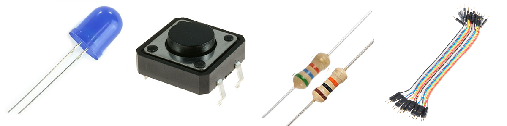

## Suggested Reading
* [Switch Basics](https://learn.sparkfun.com/tutorials/switch-basics) – The push button is a momentary switch. Momentary switches are switches which only remain in their on state as long as they’re being actuated (pressed, held, magnetized, etc.). Learn more about the different types of switches.
* [Pull-up Resistors](https://learn.sparkfun.com/tutorials/pull-up-resistors) - Pull-up resistors are very common when using microcontrollers (MCUs) or any digital logic device. This tutorial will explain when and where to use pull-up resistors, then we will do a simple calculation to show why pull-ups are important.

## How to use Logic like a Vulcan:
One of the things that makes the Adafruit HUZZAH board (and any computer) so useful is that it can make complex decisions based on the input it’s getting. For example, you could make a thermostat that turns on a heater if it gets too cold, or a fan if it gets too hot, and it could even water your plants if they get too dry. In order to make such decisions, the particle environment provides a set of logic operations that let you build complex “if” statements. They include:

expression | name | meaning
:---: | :---: | :---:
==	| EQUIVALENCE	| A == B is true if A and B are the SAME.
!=	| DIFFERENCE	| A != B is true if A and B are NOT THE SAME.
&&	| AND	| A && B is true if BOTH A and B are TRUE.
\|\|	| OR	|  A \|\| B is true if A or B or BOTH are TRUE.
!	| NOT	| !A is TRUE if A is FALSE. !A is FALSE if A is TRUE.
You can combine these functions to build complex if() statements. For example:

	if ((mode == heat) && ((temperature < threshold) || (override == true))) 
	{ 
        digitalWrite(HEATER, HIGH); 
    }

…will turn on a heater if you’re in heating mode AND the temperature is low, OR if you turn on a manual override. Using these logic operators, you can program your Feather HUZZAH board to make intelligent decisions and take control of the world around it!

## Hardware Hookup
Add the push button to the same LED circuit from the first experiment. Follow the Fritzing diagram below.
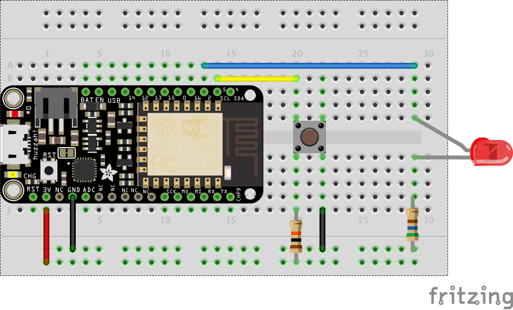

> Pay special attention to the component’s markings indicating how to place it on the breadboard. Polarized components can only be connected to a circuit in one direction. Orientation matters for the following component: **LED**

> While buttons aren't necessarily polarized (they can be flipped 180° and still work the same), they do have an orientation that is correct. The legs of the button protrude out of two sides of the button, while the other two side are bare. The sides with the legs should be on either side of the ravine on the breadboard.

## The code
Copy and paste this code into the IDE. Then upload.

  int led = 2;
    int pushButton = 5;

    void setup() {
      pinMode(led, OUTPUT);       // pin 2 is an output pin 
      pinMode(pushButton, INPUT); // pin 5 is an input --the button
    }

    void loop() {
      int pushButtonState;

      pushButtonState = digitalRead(pushButton);
      if (pushButtonState == LOW) {
        //we pushed the button
        digitalWrite(led, HIGH); //so turn on the LED
      }
      else // button not pressed
      {
        digitalWrite(led, LOW);
      }

    }

## What You Should See
When you hold down the push button, those warm fuzzy feelings from the first experiment should happen again, and the LED should shine brightly. The LED will be off when the button is released.

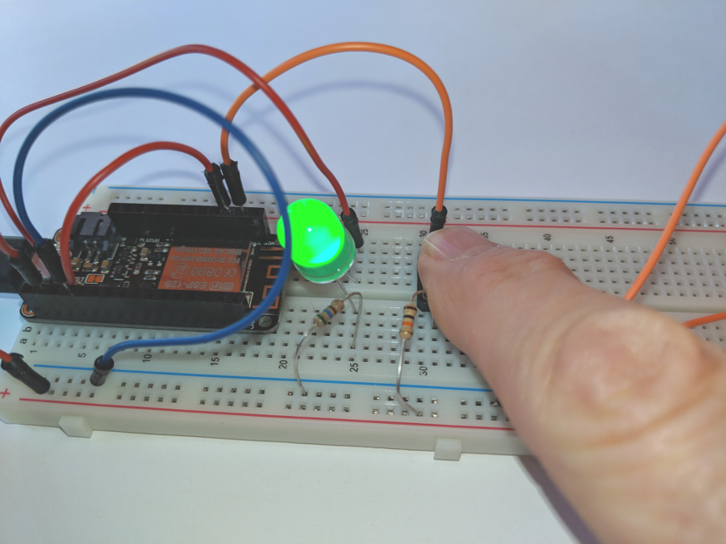

## Remixes
### Twosies  - 25xp
Add another LED and another button. Both LEDs should blink 200ms on and 200ms off only when both buttons are pressed. Otherwise both LEDs will be off.

### Beyond Twosies - 20xp
* When both buttons are pressed both LEDs should blink 200ms on and 200ms off
* When only button 1 is pressed, LED 1 should be on (steady -- no blink)
* When button 2 is pressed, LED 2 should be on (steady -- no blink)

# Part 2 the button and the net
For this part we are going to use a tutorial developed by Todd Treece at Adafruit. 

### Step 1 - connect your Feather Board to UMW's Apogee network.
Copy and paste this code into the IDE. Then upload.

      #include <ESP8266WiFi.h>
     
    void setup(){
     
       Serial.begin(115200);
       delay(500);
     
       Serial.println();
       Serial.print("MAC: ");
       Serial.println(WiFi.macAddress());
     
    }
     
    void loop(){}

Next click on the Serial Monitor Icon in the IDE:

A window should open displaying your MAC address. 

Next, login to [myresnet.com](myresnet.com) and add a device (your Feather board) by entering in the Mac address.

### Step 2 - get an Adafruit IO account and set up a dashboard
For this step, follow the [Adafruit IO Setup instructions](https://learn.adafruit.com/adafruit-io-basics-digital-input/adafruit-io-setup). Once you finish with that page **do not** continue to the wiring the circuit page. 

### Step 3 - the hardware setup
Good news. We are going to use the exact same hardware setup we used for the previous button circuit. No need to change anything. So we can skip that section of the Adafruit tutorial.

### Step 4: Arduino setup, Network Config, and Code
Continue with [the Adafruit tutorial](https://learn.adafruit.com/adafruit-io-basics-digital-input/arduino-setup).
When you get to the WiFi config section, your wifi ssid and password should be:

	#define WIFI_SSID       "APOGEE"
	#define WIFI_PASS       ""

If you are working on this project on your home network you should set these accordingly. For example, if my home network is called 'Union' and the password is 'qwerty' then the lines should be:

	#define WIFI_SSID       "Union"
	#define WIFI_PASS       "qwerty"

## What You Should See
When you press the button your dashboard should indicate the press:

# Part Three - text me
We are going to create a device that will text you when someone presses a button.

### Step 1: create a stream block on your dashboard.
It's the block to the right of the one labeled "HELLO WORLD!":

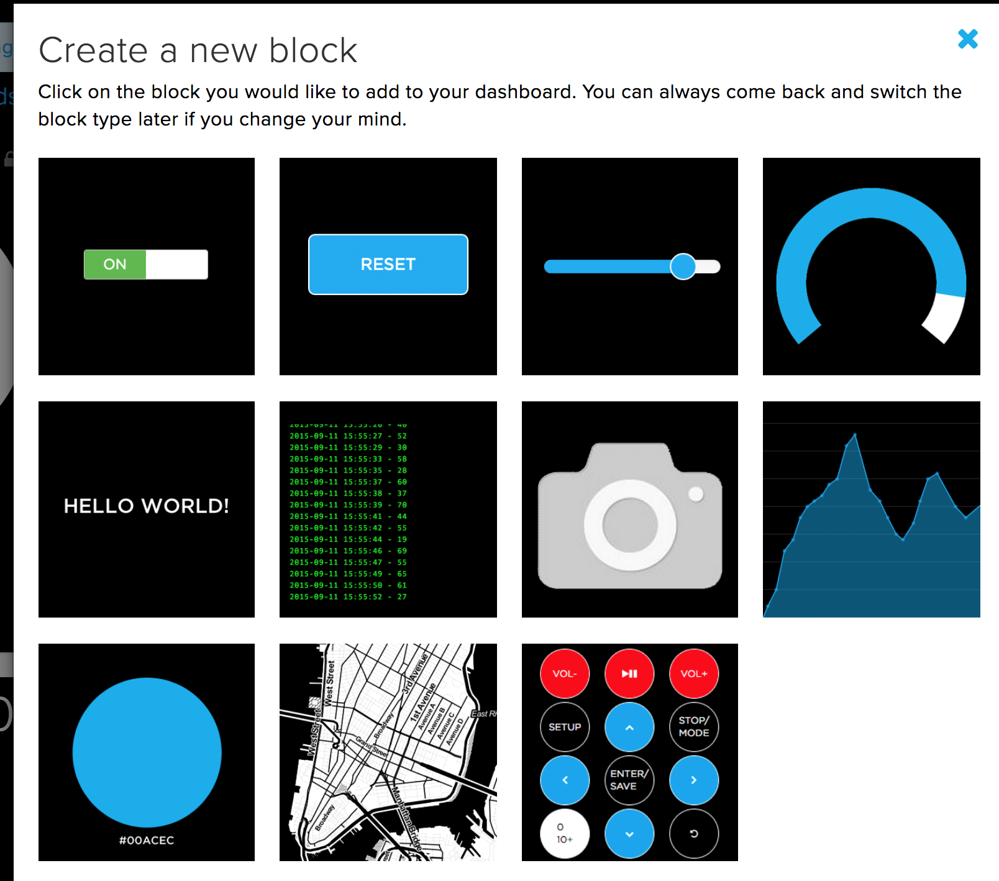

On the Choose Feed panel create a new feed (I called mine *textMe*)

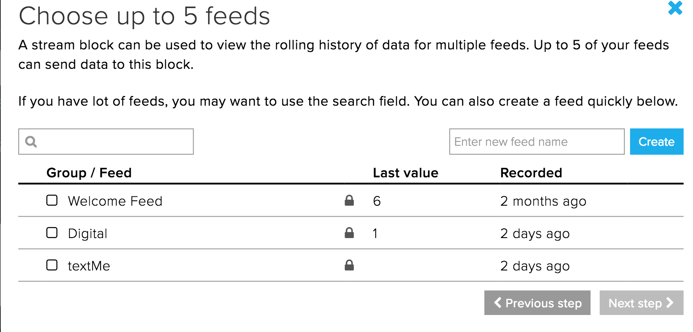

### Step 2: create the Code
Do a **Save As** on the code for Part Two. We will use that as a starting point for this project. There are two changes you need to make.

Somewhere around line 31 you need to change

	AdafruitIO_Feed *digital = io.feed("digital");
	
to whatever you named your feed (in my case, 'textMe')

	AdafruitIO_Feed *digital = io.feed("textMe");

Next, you need to replace the `loop` function with:

    void loop() {

      if(digitalRead(BUTTON_PIN) == LOW)
        current = true;
      else
        current = false;
      // return if the value hasn't changed
      if(current == last)
        return;

      // save the text "Button Pressed to the 'textMe' feed on adafruit io
      if (current == true){
      Serial.print("sending button -> ");
      digital->save("Button Pressed");
      }
      
      // store last button state
      last = current;
    }

## What You Should See
When you press the button your stream block on your dashboard should indicate the press:

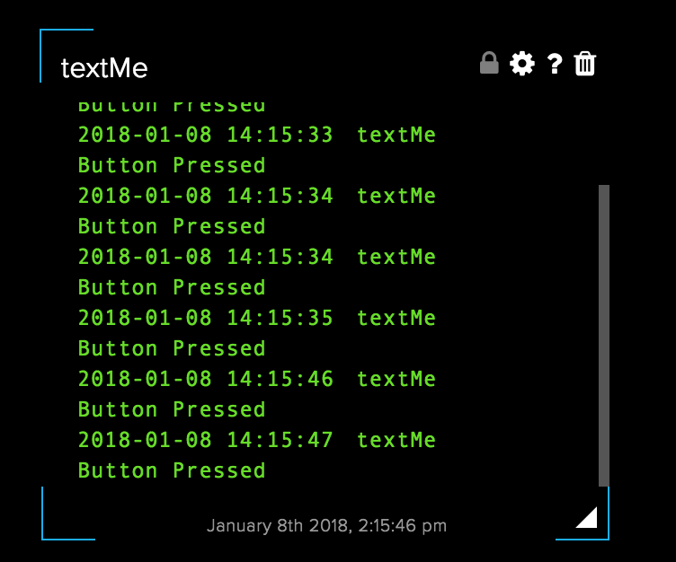

### Congratulations!

## Setting up IFTTT
Have you ever wanted to control something on the Internet with a touch of a button? How about having a button that orders new laundry detergent when pressed? Okay, that has already been done with Amazon Dash Button. However, you can make one too! For the second part of this experiment, we are going to use IFTTT to send you a text when the push button is pressed.

IFTTT is short for “if this then that.” It is a free site that makes connecting different popular apps or products really easy and fast!

Let’s get started! 
### Step 1: sign up for an IFTTT account  and connect to Adafruit
**NOTE**: You only need to do this step once regardless of how many projects you work on this semester.

Head over to [ifttt.com](http://ifttt.com) and create an account (or use your google account to sign in):

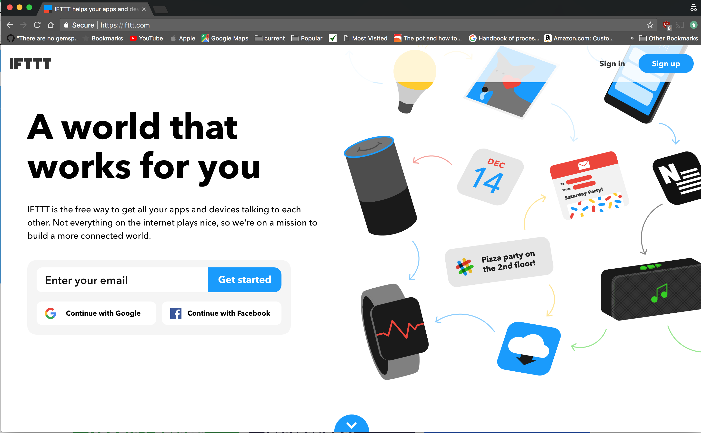

Once you are logged in to IFTTT go to [ifttt.com/adafruit](http://ifttt.com/adafruit)

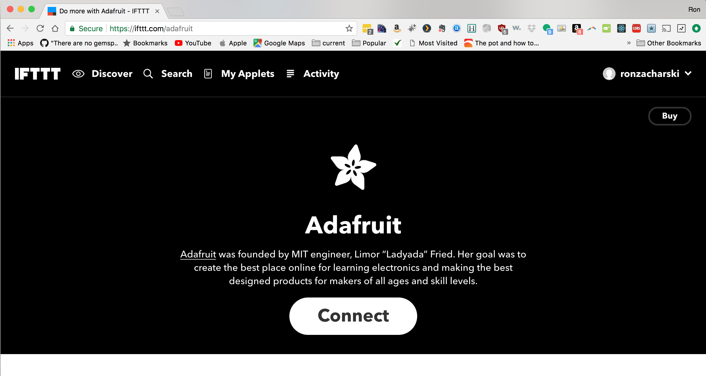

Click the 'Connect' button which will redirect you to the Adafruit site:

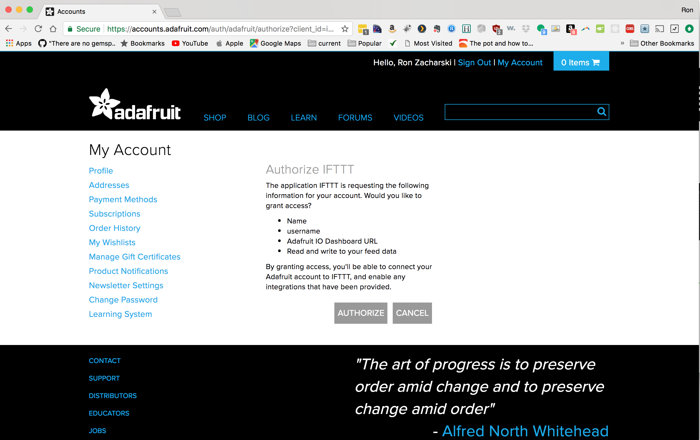

Go ahead and press the 'authorize' button and you will be redirected back to IFTTT.com

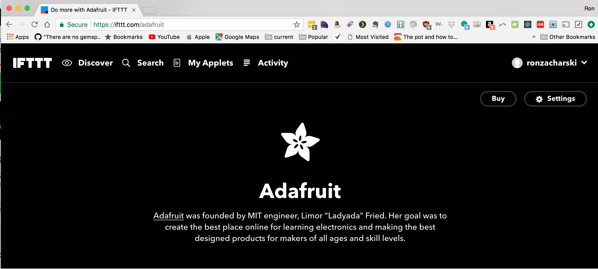

### Step 2: Make an applet to text you
Select the **My Applets** menu item and then select **New Applet**:

### Step 2.1 add the *this* component
Go ahead and click on the blue colored word *this*
:

then search for Adafruit

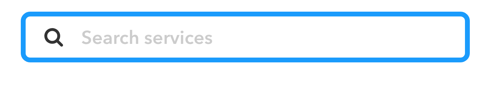

Once you find Adafruit select the **Any new data** option

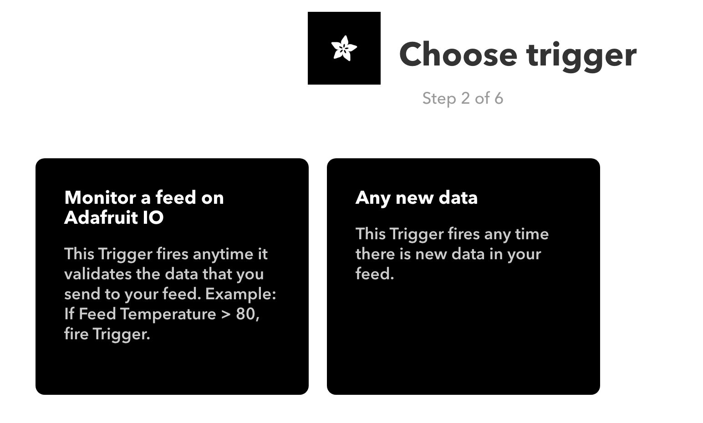
On the next page, enter the name of your feed that you used in the code above. In my case it was textMe. (this may autofill for you)

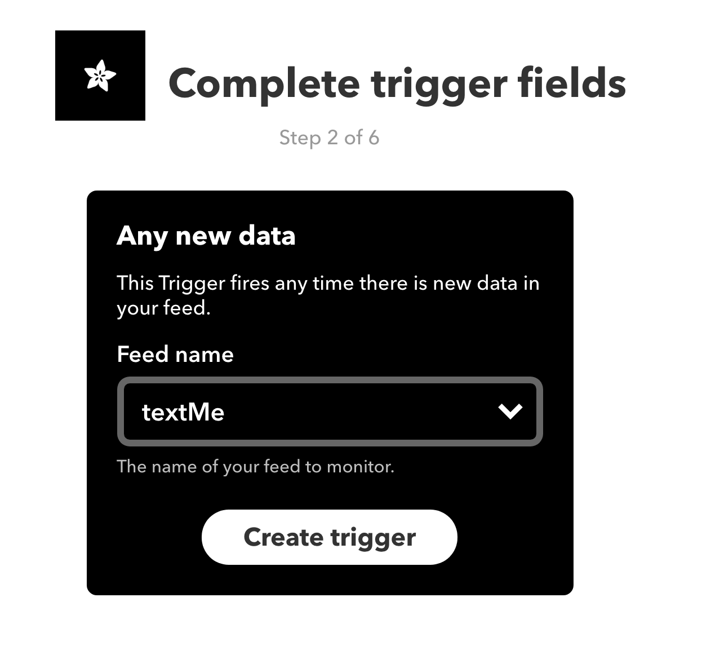

Now you are done with the **this** part of the rule.  So far we've created the code equivalent of *If there is new data on the feed called textMe*.

Now we need to specify what to do in that case.

### Step 2.2 Add the *that* component
Select the **that** colored text.

and select SMS:
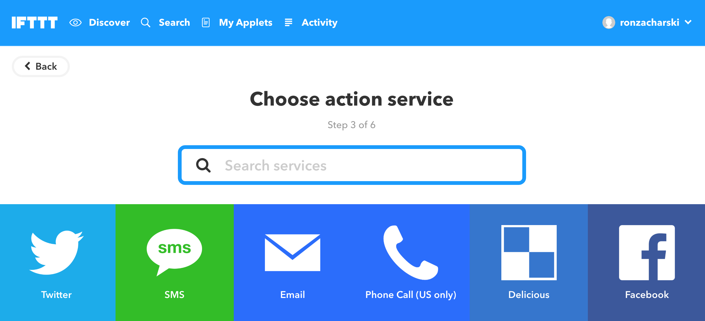

Then select **Send me an SMS**

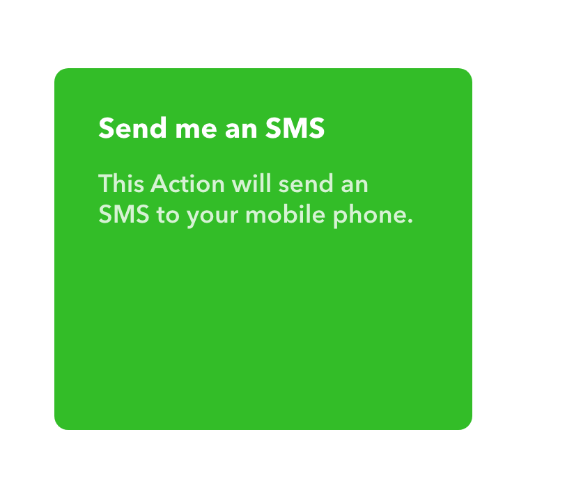

Finally edit the text message that will be sent:

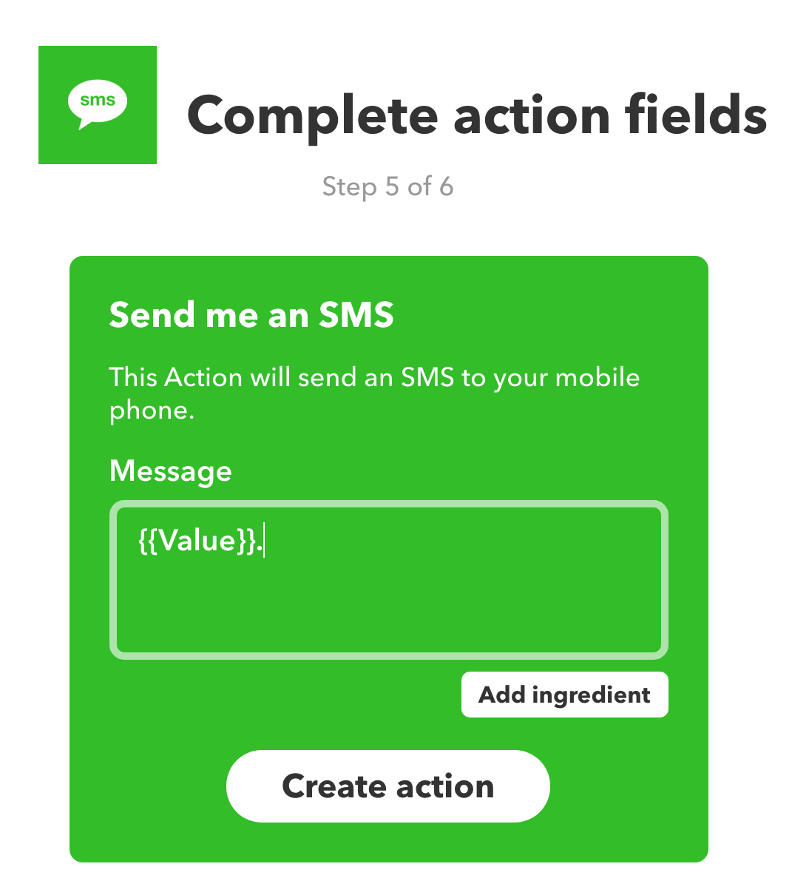

Here is what **value** means. In our Arduino code we have the line:

	digital->save("Button Pressed");
	
So we save the text "Button Pressed" to our feed. So the string *Button Pressed* is the value of the feed and with our IFTTT rule we should get the text message *Button Pressed* sent to us. If our code had:

	digital->save("Don't Forget the Milk");

then *Don't Forget the Milk* is the value which we will receive as a text message.

Go ahead and click the **Create Action** button and review your rule:

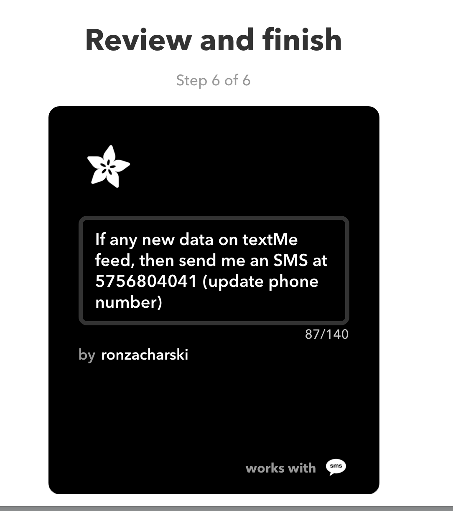

Go ahead and click the button to start your Applet.

# What you should see:

When you press the button on your Huzzah you should get a text message:

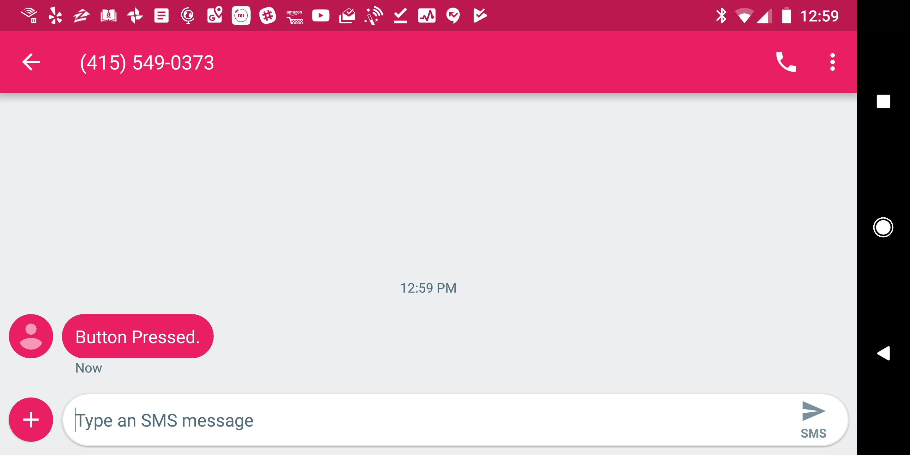

**How cool is that?**

Your Huzzah and button can be anywhere in the world (Where ever there is wifi) and you can get an sms when anyone presses the button!.

## Remix - Dog Sitter 40xp
When I am on vacation a dog sitter takes care of my two poodles.  I want to be notified via SMS (use your phone number) when the sitter presses a button. I want a device with two buttons (you can use a post-it note to label them ‘walked’ and ‘fed’.  

* When both buttons are pressed I want the text “Bodhi and Roz fed and walked.” sent
* When the fed button is pressed I want the text “Bodhi and Roz fed.”  sent.
* When the walked button is pressed I want the text “Bodhi and Roz walked.”  sent.

Instead of “Bodhi and Roz” feel free to use your pet’s name (or change the task to something different).

<a name="myfootnote1">1</a>: Tutorials are [CC BY-SA 4.0](https://creativecommons.org/licenses/by-sa/4.0/). Original page at [Sparkfun Inventor's Kit for Photon](https://learn.sparkfun.com/tutorials/sparkfun-inventors-kit-for-photon-experiment-guide/experiment-1-hello-world-blink-an-led).  This slight remix by Ron Zacharski. Button press dashboard image by Todd Treece.