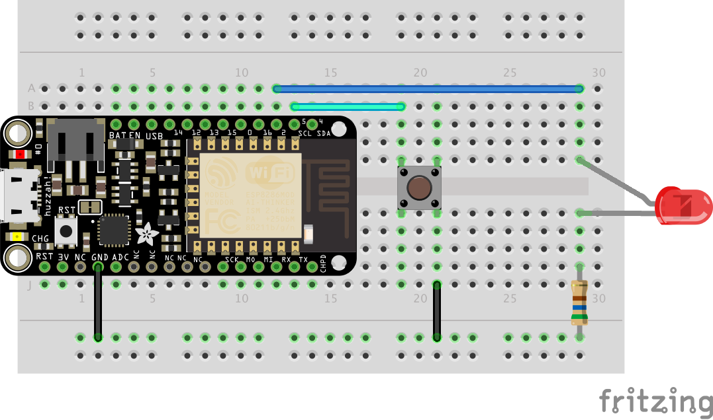
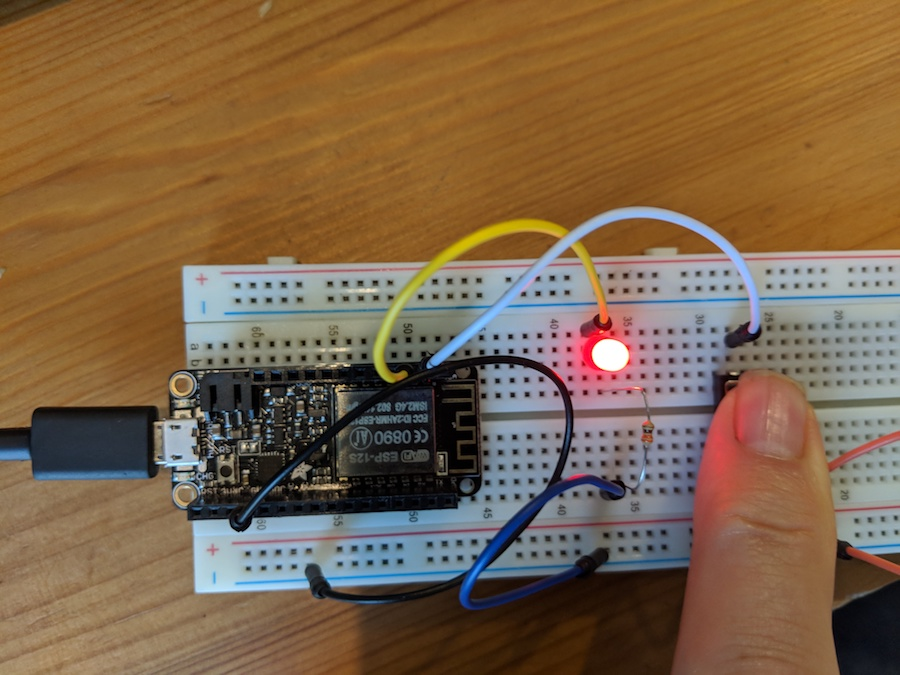

# Experiment 2: With the Touch of a Button<sup>[1](#myfootnote1)</sup>

## Introduction

Now that you have conquered blinking an LED and know what an output is, it is time to learn inputs!

In this circuit, we’ll be introducing one of the most common and simple inputs – a push button – by using a digital input. Just like the LED, the push button is a basic component that is used in almost everything. The way a push button works with your esp8266 board is that when the button is pushed, the voltage goes LOW. Your board reads this and reacts accordingly. It has an internal pull-up resistor, which keeps the voltage HIGH when you’re not pressing the button.

### Parts Needed

You will need the following parts:

- 1x LED
- 1x Push Button
- 1x 330 Resistor (orange orange brown)
- 4x Jumper Wires
  

## Suggested Reading

- **Switch Basics** – The push button is a momentary switch. Momentary switches are switches which only remain in their on state as long as they’re being actuated (pressed, held, magnetized, etc.). Learn more about the different types of switches at [this Sparkfun site.](https://learn.sparkfun.com/tutorials/switch-basics)

## Hardware Hookup

Add the push button to the same LED circuit from the first experiment. Follow the Fritzing diagram below.


> Pay special attention to the component’s markings indicating how to place it on the breadboard. Polarized components can only be connected to a circuit in one direction. Orientation matters for the **LED**

> While buttons aren't necessarily polarized (they can be flipped 180° and still work the same), they do have an orientation that is correct. The legs of the button protrude out of two sides of the button, while the other two side are bare. The sides with the legs should be on either side of the ravine on the breadboard.

## The code

Copy and paste this code into the IDE. Then upload.

    int led = 2;
    int pushButton = 5;

    void setup() {
      pinMode(led, OUTPUT);       // pin 2 is an output pin
      pinMode(pushButton, INPUT_PULLUP); // pin 5 is an input --the button
    }

    void loop() {
      int pushButtonState;

      pushButtonState = digitalRead(pushButton);
      if (pushButtonState == LOW) {
        //we pushed the button
        digitalWrite(led, HIGH); //so turn on the LED
      }
      else // button not pressed
      {
        digitalWrite(led, LOW);
      }

    }

## What You Should See

When you hold down the push button, those warm fuzzy feelings from the first experiment should happen again, and the LED should shine brightly. The LED will be off when the button is released.



# digitalRead

We have already been using digitalWrite to turn on an LED. So in

    digitalWrite(2, HIGH);

- the first argument tells what pin we are writing to. In this case we are writing to pin 2.
- the second argument tells what we are writing (or sending). `HIGH` means we are setting pin 2 to a positive voltage. `LOW` means we are setting it to ground.

`digitalWrite(2, HIGH)` sets pin 2 to a positive voltage (in our case 3 volts)

    digitalRead(5);

does something similar. If you look at the hardware you constructed you can see that when you press the button pin 5 is connected to ground (`GND`). If we do a `digitalRead` while pressing the button we will read `LOW`. If we do a `digitalRead` while not pressing the button we will read `HIGH`.

In the line:

     pushButtonState = digitalRead(pushButton);

we set the value of `pushButtonState` to whatever `digitalRead` reads. If the button is pressed then `pushButtonState` is set to `LOW` if the button is not pressed `pushButtonState` is set to `HIGH`

# `if` statements

Imagine if your friend Clara said _I'll go to the party if Ann goes, else I'll stay home_. Now let me ask you a question. Barring unforeseen circumstances, if we see Ann at the party do we think Clara is there? And a second question. If we know Ann didn't go, (and again barring unforeseen circumstances) do we think Clara went to the party?

Congratulations. You have fantastic intuitions about if-else statements. Now let's look at this part of the code:

      if (pushButtonState == LOW) {
        //we pushed the button
        digitalWrite(led, HIGH); //so turn on the LED
      }
      else // button not pressed
      {
        digitalWrite(led, LOW);
      }

The `==` means _equal_ so we can read

      if (pushButtonState == LOW) {

as meaning _if the value of pushButtonState is LOW_ or even a more English-like description: _if the button is pressed then_

The braces (`{}`) delimited the block of code that should be executed if the `if` statement is true. In this case if the button is pressed we only execute one line:

      digitalWrite(led, HIGH); //so turn on the LED

If the button is not pressed we only perform the `else` block which turns off the led.

Again, the braces (`{}`) delimited the block of code that should be executed if the `if` statement is true. Suppose we want to turn on the `redLED` and `blueLED` and turn off the `greenLED` if the button is pressed. In that case we would put all three statements inside the braces {}:

      if (pushButtonState == LOW) {
        //we pushed the button
        digitalWrite(redLED, HIGH);   //so turn on the redLED
        digitalWrite(blueLED, HIGH);  //so turn on the blueLED
        digitalWrite(greenLED, HIGH); //so turn off the greenLED
       }

### question

What does the following do?

      if (pushButtonState == LOW) {}
        digitalWrite(led1, HIGH);
        digitalWrite(led2, HIGH);
        digitalWrite(led3, HIGH);
      }
      else
      {
        digitalWrite(led1, LOW);
        digitalWrite(led2, LOW);
        digitalWrite(led3, LOW);
      }

## Is it less or fewer?

Programming languages allow us to do the normal comparisons we might have seen in math classes:

| expression | name                     | example   | meaning                              |
| ---------- | ------------------------ | --------- | ------------------------------------ |
| ==         | Equal                    | age == 21 | is age equal to 21?                  |
| !=         | Not Equal                | age != 21 | Is the value of age not equal to 21? |
| <          | Less Than                | age < 21  | Is age less than 21?                 |
| >          | Greater Than             | age > 21  | Is age greater than 21?              |
| <=         | Less Than or Equal to    | age <= 21 | Is age less than or equal to 21?     |
| >=         | Greater Than or Equal To | age >= 21 | Is age greater than or equal to 21?  |

So, for example, if the variable `temperature` contained the current temperature then

```
  if (temperature < 90) {}
    digitalWrite(led, HIGH); //so turn on the LED
  }
  else
  {
    digitalWrite(led, LOW);
  }

```

would turn on the led if the temperature was less than 90.

Suppose we want to turn on 2 leds if the temperature is greater than 90, one led if the temperature is greater than 70, and no leds if the temperature is 70 or lower. Let’s gradually convert that English description to code. First:

```
if temperature is greater than 90 {
    turn on led1
    turn on led2
}
else if the temperature is greater than 70 {
     turn on led1
     turn off led2
}
else {
   turn off led1
   turn off led2
}

```

I am hoping that makes some sense to you. Now let’s convert that description to code

```
if (temperature > 90) {
    digitalWrite(led1, HIGH);
    digitalWrite(led2, HIGH);
}
else if (temperature > 70) {
     digitalWrite(led1, HIGH);
     digitalWrite(led1, LOW);
}
else {
   digitalWrite(led1, LOW);
   digitalWrite(led1, LOW);
}

```

## How to use Logic like a Vulcan:

One of the things that makes the Adafruit HUZZAH board (and any computer) so useful is that it can make complex decisions based on the input it’s getting. For example, you could make a thermostat that turns on a heater if it gets too cold, or a fan if it gets too hot, and it could even water your plants if they get too dry. In order to make such decisions, the programming language provides a set of logic operations that let you build complex “if” statements. They include:

| expression | name |                       meaning                       |
| :--------: | :--: | :-------------------------------------------------: |
|     &&     | AND  |      A && B is true if BOTH A and B are TRUE.       |
|    \|\|    |  OR  |     A \|\| B is true if A or B or BOTH are TRUE     |
|     !      | NOT  | !A is TRUE if A is FALSE. !A is FALSE if A is TRUE. |

You can combine these functions to build complex if() statements. For example suppose we want to turn on an led only if the temperature is between 65 and 75 inclusive and the led should be off otherwise. We can do this using the `AND` operator `&&`:

      if ((temperature >= 65)  && (temperature) <=75){
        digitalWrite(led, HIGH); //so turn on the LED
      }
      else
      {
        digitalWrite(led, LOW);
      }

Using these logic operators, you can program your Feather HUZZAH board to make intelligent decisions and take control of the world around it!

## Remixes

### Twosies - 25xp

Add another LED and another button. Both LEDs should blink 200ms on and 200ms off only when both buttons are pressed. Otherwise both LEDs will be off.

### Beyond Twosies - 20xp

- When both buttons are pressed both LEDs should blink 200ms on and 200ms off
- When only button 1 is pressed, LED 1 should be on (steady -- no blink)
- When button 2 is pressed, LED 2 should be on (steady -- no blink)

# Part 2 the button and the net

For this part we are going to use a tutorial developed by Todd Treece at Adafruit.

### Step 1 - connect your Feather Board to wifi

One way cool thing about the Feather HUZZAH is that it can connect to the Internet. As with your laptop, to connect to the Internet you first need to connect to wifi. The university is very protective of their wifi and will not allow us to connect to their's so we have three options in order of preference.

1. Turn on your phone's hotspot and use that (remember the name and password of your hotspot).
2. Ask the instructors for the information of their phones' hotspot.
3. Use the Apogee network.

If you are using options 1 or 2 you can skip the next section. **UMW's APOGEE network**

### UMW's Apogee network.

Copy and paste this code into the IDE. Then upload.

      #include <ESP8266WiFi.h>

    void setup(){

       Serial.begin(115200);
       delay(500);

       Serial.println();
       Serial.print("MAC: ");
       Serial.println(WiFi.macAddress());

    }

    void loop(){}

Next click on the Serial Monitor Icon in the IDE:


A window should open displaying your MAC address.

Next, login to [myresnet.com](http://myresnet.com) and add a device (your Feather board) by entering in the Mac address.

Step 2 - get an Adafruit IO account and set up a dashboard

For this step, follow the [Adafruit IO Setup instructions](https://learn.adafruit.com/adafruit-io-basics-digital-input/adafruit-io-setup). Once you finish with that page **do not** continue to the wiring the circuit page.

### Step 3 - the hardware setup

Good news. We are going to use the exact same hardware setup we used for the previous button circuit. No need to change anything. So we can skip that section of the Adafruit tutorial.

### Step 4: Arduino setup, Network Config, and Code

Continue with [the Adafruit tutorial](https://learn.adafruit.com/adafruit-io-basics-digital-input/arduino-setup).
When you get to the WiFi config section, your wifi ssid and password should be the hotspot name and passowrd, or, for Apogee:

    #define WIFI_SSID       "APOGEE"
    #define WIFI_PASS       ""

If you are working on this project on your home network you should set these accordingly. For example, if my home network is called 'Union' and the password is 'qwerty' then the lines should be:

    #define WIFI_SSID       "Union"
    #define WIFI_PASS       "qwerty"

### Step 5: INPUT_PULLUP

The Adafruit code assumes you are using a pullup resistor. In our lecture we found that we could eliminate that resistor by editing one line of code. In this case we want to edit the file `adafdruitio_06_digital_in` and change line 36 from

     pinMode(BUTTON_PIN, INPUT);

to

      pinMode(BUTTON_PIN, INPUT_PULLUP);

## What You Should See

When you press the button your dashboard should indicate the press:


# Part Three - text me

We are going to create a device that will text you when someone presses a button.

### Step 1: create a stream block on your dashboard.

It's the block to the right of the one labeled "HELLO WORLD!":


On the Choose Feed panel create a new feed (I called mine _textMe_)


### Step 2: create the Code

Do a **Save As** on the code for Part Two. We will use that as a starting point for this project. There are three changes you need to make.

#### Change 1

Around line 24 change

    #define BUTTON_PIN 5

to

    int BUTTON_PIN = 5;

This changes the syntax to one we are familiar with.

#### Change 2

Somewhere around line 31 you need to change

    AdafruitIO_Feed *digital = io.feed("digital");

to whatever you named your feed (in my case, 'textMe')

    AdafruitIO_Feed *digital = io.feed("textMe");

#### Change 3

Next, you need to replace the `loop` function with:

    void loop() {
       current = digitalRead(BUTTON_PIN) == LOW;
      // check if something
      if (current != last) {
           // save the text "Button Pressed to the 'textMe' feed on adafruit io
           if (current == true){
              Serial.print("sending button -> ");
              digital->save("Button Pressed");
           }
           // store last button state
           last = current;
      }
    }

## What You Should See

When you press the button your stream block on your dashboard should indicate the press:


### Congratulations!

## Setting up IFTTT

Have you ever wanted to control something on the Internet with a touch of a button? How about having a button that orders new laundry detergent when pressed? Okay, that has already been done with Amazon Dash Button. However, you can make one too! For the second part of this experiment, we are going to use IFTTT to send you a text when the push button is pressed.

IFTTT is short for “if this then that.” It is a free site that makes connecting different popular apps or products really easy and fast!

Let’s get started!

### Step 1: sign up for an IFTTT account and connect to Adafruit

**NOTE**: You only need to do this step once regardless of how many projects you work on this semester.

Head over to [ifttt.com](http://ifttt.com) and create an account (or use your google account to sign in):


Once you are logged in to IFTTT go to [ifttt.com/adafruit](http://ifttt.com/adafruit)


Click the 'Connect' button which will redirect you to the Adafruit site:


Go ahead and press the 'authorize' button and you will be redirected back to IFTTT.com


### Step 2: Make an applet to text you

Select the **My Applets** menu item and then select **New Applet**:


### Step 2.1 add the _this_ component

Go ahead and click on the blue colored word _this_
:


then search for Adafruit


Once you find Adafruit select the **Any new data** option


On the next page, enter the name of your feed that you used in the code above. In my case it was textMe. (this may autofill for you)


Now you are done with the **this** part of the rule. So far we've created the code equivalent of _If there is new data on the feed called textMe_.

Now we need to specify what to do in that case.

### Step 2.2 Add the _that_ component

Select the **that** colored text.


and select SMS:


Then select **Send me an SMS**


Finally edit the text message that will be sent:


Here is what **value** means. In our Arduino code we have the line:

    digital->save("Button Pressed");

So we save the text "Button Pressed" to our feed. So the string _Button Pressed_ is the value of the feed and with our IFTTT rule we should get the text message _Button Pressed_ sent to us. If our code had:

    digital->save("Don't Forget the Milk");

then _Don't Forget the Milk_ is the value which we will receive as a text message.

Go ahead and click the **Create Action** button and review your rule:


Go ahead and click the button to start your Applet.

# What you should see:

When you press the button on your Huzzah you should get a text message:


**How cool is that?**

Your Huzzah and button can be anywhere in the world (Where ever there is wifi) and you can get an sms when anyone presses the button!.

## Remix - Dog Sitter 40xp

When I am on vacation a dog sitter takes care of my two poodles. I want to be notified via SMS (use your phone number) when the sitter presses a button. I want a device with two buttons (you can use a post-it note to label them ‘walked’ and ‘fed’.

- When both buttons are pressed I want the text “Bodhi and Roz fed and walked.” sent
- When the fed button is pressed I want the text “Bodhi and Roz fed.” sent.
- When the walked button is pressed I want the text “Bodhi and Roz walked.” sent.

Instead of “Bodhi and Roz” feel free to use your pet’s name (or change the task to something different).


<a name="myfootnote1">1</a>: Tutorials are [CC BY-SA 4.0](https://creativecommons.org/licenses/by-sa/4.0/). Original page at [Sparkfun Inventor's Kit for Photon](https://learn.sparkfun.com/tutorials/sparkfun-inventors-kit-for-photon-experiment-guide/experiment-1-hello-world-blink-an-led). This slight remix by Ron Zacharski. Button press dashboard image by Todd Treece.
