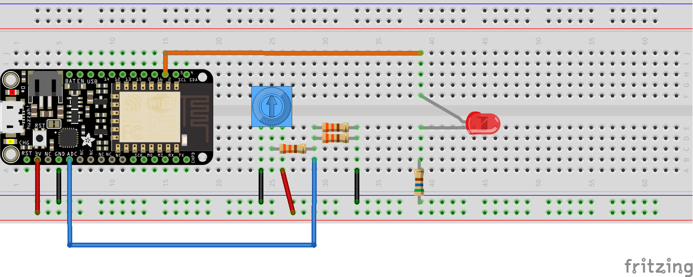

# Experiment 3: Turning the knob - Potentiometer[1](#myfootnote1)

## Introduction
In this experiment we will be working with a potentiometer (aka a variable resistor):

Beautiful, isn't it? When connected to ground and 3V (**V** stands for volts)the middle pin outputs a voltage between 0V and 3V depending on the position of the knob on the potentiometer.

A potentiometer is a perfect demonstration of a variable voltage divider circuit. The voltage is divided proportionate to the resistance between the middle pin and the ground pin. In this circuit, you'll learn how to use a potentiometer to control the brightness of an LED.

### Parts Needed
You will need the following parts:

* 1x LED
* 1x Potentiometer
* 3x 330 ohm Resistor (orange orange brown)
* jumper wires
* 1x 560Ω Resistor (green blue brown)

## Hardware Hookup
Add the push button to the same LED circuit from the first experiment. Follow the Fritzing diagram below.

[link to larger picture](pics/ex3layout.png)

## The code
Copy and paste this code into the IDE. Then upload.

  
    int pot = A0;
    int led = 2;

    // the setup routine runs once when you press reset:
    void setup() {
      // initialize serial communication at 9600 bits per second:
      Serial.begin(9600);
      pinMode(led, OUTPUT);
      
    }

    // the loop routine runs over and over again forever:
    void loop() {
      // read the input on analog pin 0:
      int sensorValue = analogRead(A0);
      Serial.println(sensorValue);
      //
      // NOW BLINK
      digitalWrite(led, HIGH);
      delay(sensorValue);
      digitalWrite(led, LOW);
      delay(sensorValue);
    }  
    
## What You Should See
You should see the LED blink faster or slower in accordance with your potentiometer. If it isn’t working, make sure you have assembled the circuit correctly and verified and uploaded the code to your board, or see the troubleshooting section.

[Click this link for video](https://photos.app.goo.gl/KSsPJDpif7aGnuTN2)

Demo for 15xp

## A short explanation
In this line:

	int sensorValue = analogRead(A0);

we instruct the Huzzah board to read the value coming from the potentiometer. The potentiometer will be outputting an output voltage between zero and one volt. The Huzzah board (the esp8266) converts this to an integer between 0 and 1024 inclusive. When the potentiometer is in the 'off' position and is outputting 0 volts (or 0V) the Huzzah will. read 0. When the pot is turned all the way on the Huzzah will read 1024. 

The variable named `sensorValue` is set to whatever the Huzzah reads from the pot. When that value is large, say 1024, the LED will blink slowly (on for 1 second and off for 1 second) and when the value is small it will blink rapidly-- so rapid that it is imperceptible.

## Something completely different
Suppose we want to do something completely different. When the potentiometer is turned to the low end, the LED will be off, when it is turned to the high end it will blink.  To implement this we need to be a bit more specific. Since the entire range is 0 to 1024, suppose we design the code so that if sensorValue is below 512 the LED will be off and if it is above that the LED will blink. Any clues on how to do this?

### A hint
If you are thinking this sounds like a job for an `if`` statement, you would be correct. Maybe something like

    if (sensorValue < 512){
           // shut the LED off
      }
      else {
           // blink  
      }
     

**demo for 10xp**

## a Challenge
Suppose I want the potentiometer to do 3 things. When it is in the lower third of its range the LED is off; when it is in the middle third the LED is blinking; and in the upper third it is steadily on. Can you modify the code to do this?

### hint

The structure might be like

    if (something){
         // do one thing
      }
      else if (something){
        // do another thing
      }
      else {
        // do a third thing
      }
     

20XP

## Bike Light Challenge  - up to 50xp
Can you implement the device illustrated in [this Video showing a Bike Light](https://goo.gl/photos/XWu3pyBmLAdMvCzC7)
Initially, when the potentiometer is all the way to the left all lights are off. As you move it to the right, it changes to different modes.8xp for each mode (not counting all off) up to 5 modes. 10xp per mode if you use 5 LEDs.

<a name="myfootnote1">1</a>: This experiment is a remix of Sparkfun’s [Reading a Potentiometer](https://learn.sparkfun.com/tutorials/sik-experiment-guide-for-arduino---v32/experiment-2-reading-a-potentiometer).
