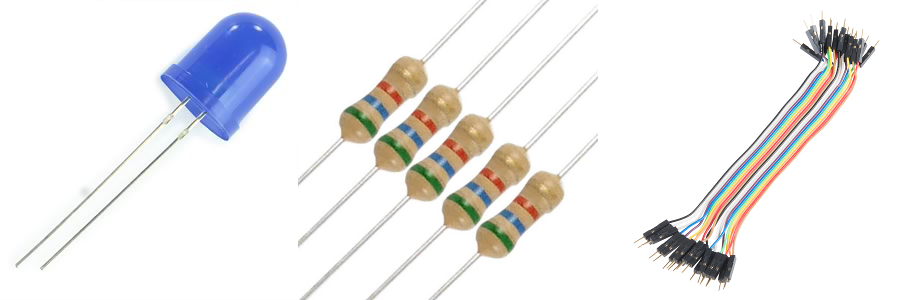
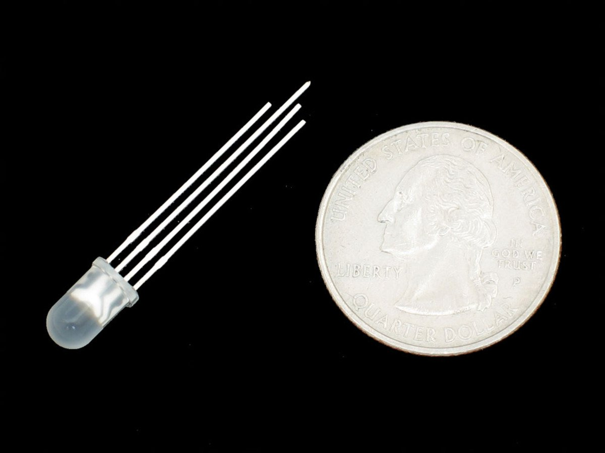
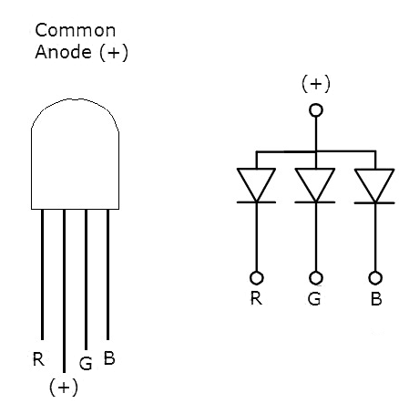
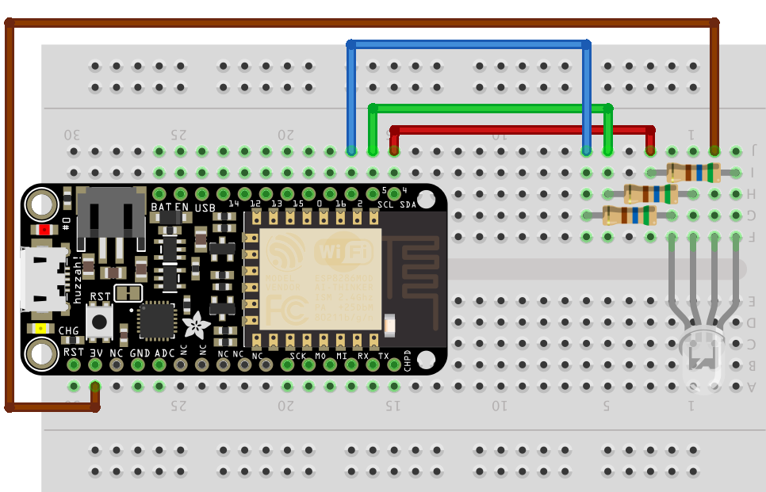

# Experiment 4: Dimming and the Magical Multicolor LED[1](#myfootnote1)

# Part 1: I have in my hand a plain, ordinary LED

## Introduction
Let's return to the first circuit we built:

#### Parts Needed
You will need the following parts:

* 1x LED (Choose any color)
* 1x 560Ω Resistor
* 2x Jumper Wires

## Hardware Hookup

[Link to larger image](pics/experiment4a_bb.png)

## Discussion
So far we learned how to turn the LED on; how to turn it off; how to blink the LED; and how to blink it in various patterns. In this experiment we are going to learn how to have different levels of brightness. Earlier in the class I said those digital pins can only be on or off and now I am saying the opposite. How can this be?

Here is the non-technical explanation. Suppose you are in a room and your little brother quickly turns the lights on and off. Faster and faster. At some point, if your brother is particularly quick, this stops being extremely annoying and instead we stop perceiving the on and off and instead sense a steady dim light. The ons and offs are there but we don’t perceive them. If the offs are a bit longer than the ons the light is dimmer and if the ons are a bit longer than the offs then the light will be brighter. This is called Pulse Width Normalization or PWM. It let's use our digital *on* and *off* to make something that looks on the surface as non-digital.  **This is pretty cool!**
  
Fortunately, we don't need to write code that quickly turns the LED on and off. We tell our ESP8266 microprocessor how bright the LED should be, and it takes care of the details. Here is the scoop. Instead of using:

	digitalWrite(led, HIGH);
	
we are going to use

	analogWrite(led, 1023);
	
The number 1023 represents how bright we want the LED. 0 means the LED is off, 1023 means the LED is at its brightest, 512 means mid brightness --- you get the idea.

> You may be wondering why 1023? Wouldn't it better to use some normal number like 1000? Here is the scoop. Computers operate on the binary number system. I will not go into too much detail, but powers of 2 are more natural: 2, 4, 8, 16, 32 ...   Now the range 0 to 1023 represents 1024 distinct values and 1024 is a power of two-- 2^10 IS 1024. That is probably more than you want to know.

## A sample program to have a mid-brightness LED light.  (
Open up the Arduino IDE (the program you just installed in the step above). Then, under the file menu select **New** and type in the following program

	int led = 2;

	void setup() {
	  pinMode(led, OUTPUT);
	}

	void loop() {
	  analogWrite(led, 512);
	}
	
## Multi-LED bonuses for the remixes below

1. for each of the remixes below you will get 25% xp more if you use 3 LEDs. For example, if you demo remix 1 with 3 leds you will get 250xp. The good news is that if you wire those three LEDs once, you do not have to do any rewiring of those LEDs for the other remix.
2. You will get 25% more if you use variables. These includes using variable names that make sense to people.

## Remix 1 Loopy-Lights™    20xp

Can you write code that cycles the LED(s) from off, low brightness, medium brightness, high brightness). 
So constantly off - low - mid - high - off - low - mid - high …

## Remix 2  Potentiometer-brightness 20xp

Can you write code so that a potentiometer controls the brightness of the LEDs?
This code is pretty short. You will have 1 or 2 lines inside the setup function and 2 to 3 lines of code inside the loop function.  When the potentiometer if all the way to the left, the led is off, as you turn the potentiometer gradually to the right the led gets gradually brighter.

## Remix 4  a for loopy pulsey light thing 20xp

Can you write code so that the lights start dark, gradually increase in brightness and then gradually dim and then repeat?

Here is a puzzler that may help you with one of the above problems. What does the following code do?

	int led = D2;
	int total = 100;
	int add =  100;

	void setup() {
	   pinMode(D2, OUTPUT);
	}

	void loop() {
	    digitalWrite(led, HIGH);
	    delay(total);
	    digitalWrite(led, LOW);
	    delay(total);
	    total = total + add;
	    if ((total == 1000) || (total == 100)){
	        add = -add;
	    }
	}

If you understand this code, it should provide a clue how to. do the loopy pulsey thing.
 
# Part 2 The Magical Mysterious World of the Multicolor LED

In this part of the lab we are going to be working with what is called an RGB LED (RGB stands for Red, Green, Blue). There are 4 wires sticking out of this LED. The one we have in our kit is called a Common-Anode type, which simply means that we connect the long leg to 3V.  (The other type is the Common-Cathode type where we connect the long leg to ground) Here is a picture that may help:

Having a common-anode RGB LED makes life a tad more ~~difficult~~ interesting. In the above example if we wanted the `led` off we would write:

	analogWrite(led, 0);

and if we wanted full brightness we had 

	analogWrite(led, 1023);

### Here's what I don't like about common-anode LEDs.	
With a common-anode LED things are topsy-turvy. To have a `green` led off we would have

	analogWrite(green, 1023);
	
and if we wanted full brightness we would have  

	analogWrite(green, 0);

We could also use digitalWrite. In this case 

	digitalWrite(green, HIGH)
	
would be off and 

	digitalWrite(green, LOW);
	
would be on.
## Fiddling with colors
In this single LED we can fiddle with the brightness of **R**ed, **G**reen, and **B**lue.  For any color we would specify values for each of these. For example, if we wanted solid blue we might have:

	analogWrite(red, 1023);
	analogWrite(green, 1023);
	analogWrite(blue, 0);

Magenta (aka Fushia) is an equal mix of red and blue so if we wanted a bright magenta we might have:

	analogWrite(red, 0);
	analogWrite(green, 1023);
	analogWrite(blue, 0);

If you wanted a dimmer magenta you could do:

	analogWrite(red, 300);
	analogWrite(green, 1023);
	analogWrite(blue, 300);

Pink is mostly red with some green and blue:

	analogWrite(red, 1023);
	analogWrite(green, 800);
	analogWrite(blue, 800);

**Let's get to work!**

## Hardware hookup

[link to larger picture](pics/es4b.png)

## The code

And here is code that will display 8 colors just using digitalWrite:

    int RED_PIN = 4;
    int GREEN_PIN = 5;
    int BLUE_PIN = 2;

    int DISPLAY_TIME = 100;  // In milliseconds

    void setup()
    {
      pinMode(RED_PIN, OUTPUT);
      pinMode(GREEN_PIN, OUTPUT);
      pinMode(BLUE_PIN, OUTPUT);
    }

    void loop()
    {

      mainColors();
    }

    // Here's the mainColors() function we've written.

    // This function displays the eight "main" colors that the RGB LED
    // can produce. 

    void mainColors()
    {
      // Off (all LEDs off):

      digitalWrite(RED_PIN, HIGH);
      digitalWrite(GREEN_PIN, HIGH);
      digitalWrite(BLUE_PIN, HIGH);

      delay(1000);

      // Red (turn just the red LED on):

      digitalWrite(RED_PIN, LOW);
      digitalWrite(GREEN_PIN, HIGH);
      digitalWrite(BLUE_PIN, HIGH);

      delay(1000);

      // Green (turn just the green LED on):

      digitalWrite(RED_PIN, HIGH);
      digitalWrite(GREEN_PIN, LOW);
      digitalWrite(BLUE_PIN, HIGH);

      delay(1000);

      // Blue (turn just the blue LED on):

      digitalWrite(RED_PIN, HIGH);
      digitalWrite(GREEN_PIN, HIGH);
      digitalWrite(BLUE_PIN, LOW);

      delay(1000);

      // Yellow (turn red and green on):

      digitalWrite(RED_PIN, LOW);
      digitalWrite(GREEN_PIN, LOW);
      digitalWrite(BLUE_PIN, HIGH);

      delay(1000);

      // Cyan (turn green and blue on):

      digitalWrite(RED_PIN, HIGH);
      digitalWrite(GREEN_PIN, LOW);
      digitalWrite(BLUE_PIN, LOW);

      delay(1000);

      // Purple (turn red and blue on):

      digitalWrite(RED_PIN, LOW);
      digitalWrite(GREEN_PIN, HIGH);
      digitalWrite(BLUE_PIN, LOW);

      delay(1000);

      // White (turn all the LEDs on):

      digitalWrite(RED_PIN, LOW);
      digitalWrite(GREEN_PIN, LOW);
      digitalWrite(BLUE_PIN, LOW);

      delay(1000);
    }

###  Dimmer Red
Here is some code that pulses the red part of the multicolor LED (and introduces the `for` loop):

		int redLed = 4;
		int greenLed =5;
		int blueLed = 2;
		int display_time = 2; //in milliseconds
		int redColor = 0;
		int blueColor = 0;
		int greenColor = 0;

		void setup() {
		  pinMode(redLed, OUTPUT);
		  pinMode(greenLed, OUTPUT);
		  pinMode(blueLed, OUTPUT);

		}

		void dimmerRed(){
		  // first turn off the green and blue LEDs
		  analogWrite(greenLed, 1023);
		  analogWrite(blueLed, 1023);
		  
		  // set the base value of the red led
		  // it should be at its brightest - so 0
		  redColor = 0;

		  // now make red dimmer and dimmer
		  for (int i = 0; i < 1024; i += 1){
		    analogWrite(redLed, redColor + i);
		    delay(display_time);
		  }   
		}

		void loop(){
		  dimmerRed();
		}

As you can see, the red light starts at its brightness (value 0) and quickly dims (goes to 1023).

Let's look at the code for the function `dimmerRed`. 

* The first things we do is turn off  green and blue by using `analogWrite(greenLed, 1023)` and `analogWrite(blueLed, 1023)`
* Since we want the red part of the led to start at its brightest, we set the variable `redColor` initially to zero.
* Now we start our `for` loop. The first time through the loop `i` is 0, the next time it is 1, then 2 until `i` equals 1024 and then the loop stops.
* Next we have `analogWrite(redLed, redColor + i);`  Initially redColor is 0 and i is 0 so we set the redLed to brightness 0. The next time through the loop i is 1 so we set the brightness to 1 and so on.

## Red and Blue Passing in the Night
#### part 1  redToBlue- 10xp
Can you write a function `redToBlue` so that as the red dims the blue increases in brightness?  The format of the function is similar to that for `dimmerRed`. Once you've written that function change the loop function to:

		void loop(){
		  redToBlue();
		}
to test it.

### part 2: red and blue passing in the night - 20xp 
Ok. Part 1 had you move from red to blue and then there was a sudden jump back to red. Can you modify the code so that the light gradually goes from red to blue and then gradually back again? This may involve writing another function.

### Part 3: Roy G Biv  - 10-20xp
Now we want the multicolor led to go gradually from red to green then green to blue and then blue to red? Think about how you would break this problem down into simple functions. 10xp for a solution that works, 20xp for code that breaks this task down into simpler subtasks.

### Part 4: Roy G Biv R Vib G Yor - 15xp
This is a puzzle. What do Mikaela and I want to see?

# Controlling Color from Your Phone - 15xp
Follow the [Adafruit Tutorial](https://learn.adafruit.com/adafruit-io-basics-color/overview).

<a name="myfootnote1">1</a>: Tutorials are [CC BY-SA 4.0](https://creativecommons.org/licenses/by-sa/4.0/). Original page at [Sparkfun Inventor's Kit for Photon](https://learn.sparkfun.com/tutorials/sparkfun-inventors-kit-for-photon-experiment-guide/experiment-1-hello-world-blink-an-led).  This slight remix by Ron Zacharski
