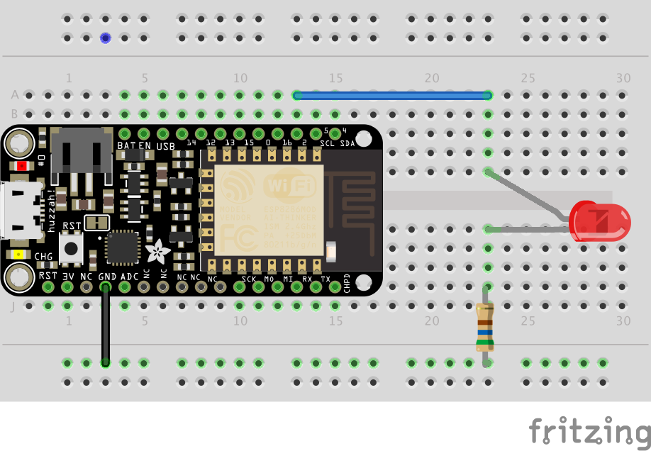

# Experiment 4: Dimming and the Magical Multicolor LED[1](#myfootnote1)

# Part 1: I have in my hand a plain, ordinary LED

## Introduction
Let's return to the first circuit we built:

#### Parts Needed
You will need the following parts:

* 1x LED (Choose any color)
* 1x 560Ω Resistor
* 2x Jumper Wires

## Hardware Hookup

[Link to larger image](pics/experiment4a_bb.png)

## Discussion
So far we learned how to turn the LED on; how to turn it off; how to blink the LED; and how to blink it in various patterns. In this experiment we are going to learn how to have different levels of brightness. Earlier in the class I said those digital pins can only be on or off and now I am saying the opposite. How can this be?

Here is the non-technical explanation. Suppose you are in a room and your little brother quickly turns the lights on and off. Faster and faster. At some point, if your brother is particularly quick, this stops being extremely annoying and instead we stop perceiving the on and off and instead sense a steady dim light. The ons and offs are there but we don’t perceive them. If the offs are a bit longer than the ons the light is dimmer and if the ons are a bit longer than the offs then the light will be brighter. This is called Pulse Width Normalization or PWM. It let's use use our digital *on* and *off* to make something that looks on the surface as non-digital.  **This is pretty cool!**
  
Fortunately, we don't need to write code that quickly turns the LED on and off. We tell our ESP8266 microprocessor how bright the LED should be, and it takes care of the details. Here is the scoop. Instead of using:

	digitalWrite(led, HIGH);
	
we are going to use

	analogWrite(led, 255);
	
The number 255 represents how bright we want the LED. 0 means the LED is off, 255 means the LED is at its brightest, 125 means mid brightness --- you get the idea.

## A sample program to have a mid-brightness LED light.  (
Open up the Arduino IDE (the program you just installed in the step above). Then, under the file menu select **New** and type in the following program

	int led = 2;

	void setup() {
	  pinMode(led, OUTPUT);
	}

	void loop() {
	  analogWrite(led, 100);
	}
	
## Multi-LED bonuses for the remixes below

1. for each of the remixes below you will get 25% xp more for each additional LED light you have up to a maximum of 3 total LEDs. For example, if you demo remix 1 with 3 leds you will get 30xp. The good news is that if you wire those three LEDs once, you do not have to do any rewiring of those LEDs for the other remix.
2. You will get 50% more if you use variables. These includes using variable names that make sense to people.

## Remix 1 Loopy-Lights™    20xp

Can you write code that cycles the LED(s) from off, low brightness, medium brightness, high brightness). 
So constantly off - low - mid - high - off - low - mid - high …

## Remix 2  Potentiometer-brightness 20xp

Can you write code so that a potentiometer controls the brightness of the LEDs?
This code is pretty short. You will have 1 or 2 lines inside the setup function and 2 to 3 lines of code inside the loop function.

## Remix 4  a for loopy pulsey light thing 25xp

Can you write code so that the lights start dark, gradually increase in brightness and then gradually dim and then repeat?

Here is a puzzler that may help you with one of the above problems. What does the following code do?

	int led = D2;
	int total = 100;
	int add =  100;

	void setup() {
	   pinMode(D2, OUTPUT);
	}

	void loop() {
	    digitalWrite(led, HIGH);
	    delay(total);
	    digitalWrite(led, LOW);
	    delay(total);
	    total = total + add;
	    if ((total == 1000) || (total == 100)){
	        add = -add;
	    }
	}

If you understand this code, it should provide a clue how to. do the loopy pulsey thing.
 
# Part 2 The Magical Mysterious World of the Multicolor LED

In this part of the lab we are going to be working with what is called an RGB LED (RGB stands for Red, Green, Blue). There are 4 wires sticking out of this LED. The one we have in our kit is called a Common-Anode type, which simply means that we connect the long leg to 3V.  (The other type is the Common-Cathode type where we connect the long leg to ground)Here is a picture that may help:

[link to larger picture](pics/es4b.png)

<a name="myfootnote1">1</a>: Tutorials are [CC BY-SA 4.0](https://creativecommons.org/licenses/by-sa/4.0/). Original page at [Sparkfun Inventor's Kit for Photon](https://learn.sparkfun.com/tutorials/sparkfun-inventors-kit-for-photon-experiment-guide/experiment-1-hello-world-blink-an-led).  This slight remix by Ron Zacharski
