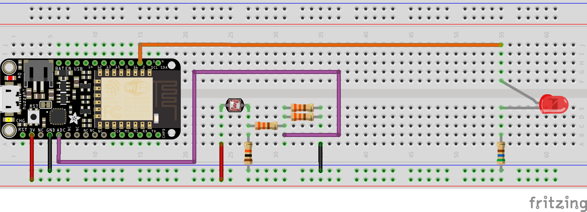

# Experiment 5: The Light Sensor[1](#myfootnote1)
In experiment 3, you got to use a potentiometer, which varies resistance based on the twisting of a knob. In this circuit, you’ll be using a photoresistor, which changes resistance based on how much light the sensor receives.  So it is sort of like a potentiometer controlled by light!

## If you still have your multicolor LED hooked up:
Very cool. Keep that circuit and just add the photoresistor as shown below. Don't add another LED.

#### Parts Needed
In addition to the parts needed for your RGB LED, or plain LED you will need:

* 1x photoresistor (pictured above)
* 1x 10KΩ Resistor (when we talk about this we say "ten K ohm resistor).  (brown, black, orange)
* 3x 330 ohm Resistor (orange orange brown)
* Jumper Wires Galore

## Hardware Hookup
Again, if you have your RGB hooked up, leave it  and ignore the LED in this diagram.

[Link to larger image](pics/photoresistor_bb.png)

## The basic code

int sensor = A0;

		void setup() {
		  pinMode(sensor, OUTPUT);
		  Serial.begin(115200); 
		}

		void loop() {
		  int lightLevel = analogRead(sensor);
		  Serial.println(lightLevel);
		  delay(1000);
		}

This will display integers in the serial monitor denoting the brightness level. The possible range is 0 to 1023. Your numbers will like not reach either end of that range. Cover the photoresistor with your hand to make it totally dark and note the number. Use the flashlight app on your phone, shine it on the photoresistor and note that number. Talk to me or Mikaela if the number is below 400 when it is super bright.

## Task 1: 15xp
Make a device when the LED is off when it is dark out. As the light increases the LED gets brighter. This does not require an `if` statement.

## Task 2 Nightlight: 15xp
A device the reverse of the above. When it is bright in the room the LED is off. As the room dims, the LED brightens.

## Task 3: 30xp   A moody night light 
### light sensor + rgb led remix (oh no. more math)
Can you make a device that when it is dark the rgb led is blue; as it gets brighter it turns to indigo; and as it gets bright still, violet.

## Task 4 Optional: 20xp   Super Hacker Challenge Nightlight
There are some of you that find this class pretty easy so I thought I would throw in this hacker challenge. This combines the above with the

###  Controlling Color from Your Phone App
you wrote for the previous experiment.

Can you create a nightlight app that:

1. you can set the color via your phone (or computer).
2. but the light only goes on when it is dark out.

