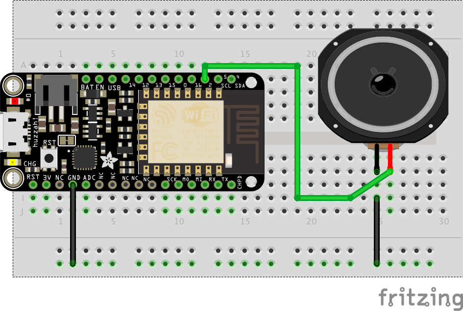
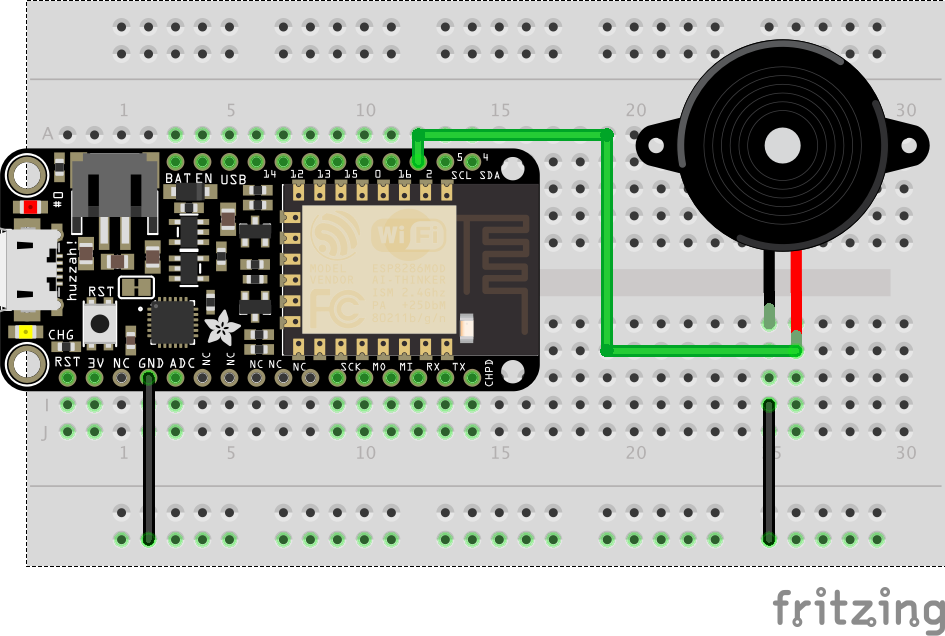

# Experiment 6: Finally some Music[1](#myfootnote1)
In this experiment we are going to learn how to make a speaker or buzzer click. Now a click may not sound like much :-) but when we put clicks together we can make more interesting sounds. For example, if we have 440 clicks in a second we have the note 'A'.   If we have 3 short periods of it clicking at 392 clicks per second followed by a period of it clicking at 261 clicks per second we have the opening four notes of Beethoven's Fifth Symphony (albeit  in a musical greeting card quality). Let's get clicking.

#### Parts Needed
You will need:

* 1x buzzer or speaker (speaker is preferred -- Ask me for one)
* a Few Jumper Wires 

## Hardware Hookup

[Link to larger image](pics/speaker_bb.png)

[Link to larger image](pics/buzzer_bb.png)

## The basic code
[Here is a link to the code](https://raw.githubusercontent.com/zacharski/esp8266book/master/functionalSOS/music.ino)

### Demo the code!   15xp

#### Question
How do you get the song to play exactly once?

## Remix. 70-125xp
Can you write code to have the buzzer play a recognizable (and correct) tune that spans an octave and a half?  (see [frequencies for the equal temperament scale](http://pages.mtu.edu/~suits/notefreqs.html)). 35-60xp depending on quality/quantity.  

* 70xp - song length <= 20
* 100xp - song length > 20 - no wrong notes or rhythms
* Up to 25xp additional based on complexity 
    * complex rhythms
    * Complexity of song (old macdonald vs. Send My Love)
    * entire song plays - not just a snippet
.

<a name="myfootnote1">1</a>: Tutorials are [CC BY-SA 4.0](https://creativecommons.org/licenses/by-sa/4.0/). Original page at [Sparkfun Inventor's Kit for Photon](https://learn.sparkfun.com/tutorials/sparkfun-inventors-kit-for-photon-experiment-guide/experiment-1-hello-world-blink-an-led).  This slight remix by Ron Zacharski
