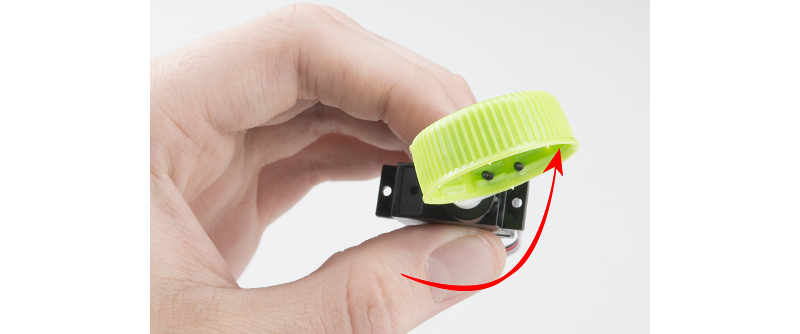

# Experiment 7: An M&M Dispenser[1](#myfootnote1)

###XP Summary

* Preliminaries - 15xp
* Modulo Challenge - 25xp
* M&M Dispenser - 40
* 

Today we are going to look at a servo. In particular, we are going to look at how a servo can deliver us chocolate. ([Here is a link to my favorite song about chocolate --- Warning: not for the weak](https://www.youtube.com/watch?v=WIKqgE4BwAY). And here are the [lyrics](https://genius.com/Babymetal-gimme-chocolate-english-translation-lyrics))

A servo is a motor that can turn a specific number of degrees. For example, we can tell a servo to move exactly 45 degrees and then change direction and move 10 degrees. There are many uses of servos including

* robotics - every joint of a robot might have a servo so an arm, for example, can move in a very precise way.
* cameras - many cameras have built in servos that enable them to do auto-focusing.
* satellite-tracking antennas and solar panel movement (both need to track something)
* the hard disk in your laptop (controls arm movement inside the disk) 
* remote controlled hobby planes, cars, and boats.
* and many others

We are going to use a servo in its most important role: Delivering M&M candies!

### Let's get started

## Preliminaries - 15xp
### Hardware Hookup

[link to larger picture](pics/servo_bb.png)

Before you continue make sure to put an arm on the servo. It just makes it more fun!

### The Code

#include <Servo.h>

    Servo myservo;
    int button = 2;
    int servoPin = 16;
    int pos = 0;        //variable to keep track of the servo's position
    bool flag = 1;      //variable to keep track of the button presses
    void setup() {
      pinMode(button, INPUT_PULLUP);
      Serial.begin(115200);
      myservo.attach(servoPin);  //Initialize the servo attached to pin 16
      myservo.write(180);        //set servo to furthest position
      delay(500);                //delay to give the servo time to move to its position
      myservo.detach();          //detach the servo to prevent it from jittering

    }

    void loop() {
        if(digitalRead(button) == LOW) //if a button press has been detected...
        {
          //This is known a s state machine.
          //It will move the servo to the opposite end from where it's set currently
          if(flag == 1)
            pos = 0;
          if(flag == 0)
            pos = 180;

          myservo.attach(servoPin);
          myservo.write(pos);
          delay(500);           //debounce and give servo time to move
          myservo.detach();
          flag = !flag;         //set flag to the opposite of what it's currently set to
          Serial.println(pos);  //prints to the serial port to keep track of the position
        }
    }
    
### What You Should See 
When you first upload the code, give it a few seconds, then you should see the motor move to the 180° position. Once there, it will stay until the button is pressed. Press the button to move it to 0°. Press the button again and it will move back to the first position. The purpose of this code it to give you an idea for the full range of motion for the servo motor and to help you plan out your M&M Feeder. The code above is my slightly modified version of code written by the folks at Sparkfun. ([Sparkfun](sparkfun.com), in addition to having super nice people, has a wide assortment of really cool electronic gizmos -- check it out). Anyway, the software developer in me never was 100% happy with that code. I don't like this bit:

	      if(flag == 1)
            pos = 0;
          if(flag == 0)
            pos = 180;

So here is my reworked version:

    #include <Servo.h>

    Servo myservo;
    int button = 2;
    int servoPin = 16;
    int pos = 0;        //variable to keep track of the servo's position
    int max_position = 360; 

    void setup() {
      pinMode(button, INPUT_PULLUP);
      Serial.begin(115200);
      myservo.attach(servoPin);  //Initialize the servo attached to pin 16
      myservo.write(180);        //set servo to furthest position
      delay(500);                //delay to give the servo time to move to its position
      myservo.detach();          //detach the servo to prevent it from jittering

    }

    void loop() {
        if(digitalRead(button) == LOW) //if a button press has been detected...
        {
          myservo.attach(servoPin);
          myservo.write(pos);
          delay(500);           //debounce and give servo time to move
          myservo.detach();
          Serial.println(pos);  //prints to the serial port to keep track of the position
          pos = (pos + 180) % max_position;
        }
    }

Anyone who know me knows I love, love, love the **modulo operator**, **%**  that we see in this line:

	   pos = (pos + 180) % max_position;
	   
The modulo operator gives us the reminder when we divide the first number by the second (think grade school math). So

	4 % 2
	
is `0` because there is no remainder when we divide 4 by 2. 

	4 % 3

is 1 because when we divide 4 by 3 we have 1 left over and 

	26 % 5
	
is also 1 because when we divide 26 by 5 we have a remainder of 1. Finally,

     5 % 25
     
is 5 because no 25s go into 5 so we have 5 left over.

So far so good.

So look at the code above and see what the values are of 

     pos
     max_position
     
Take the time to actually look at the code while I count to 10

* 1
* 2
*  3
*  4
*  5
*  6
*  7
*  8
*  9
*  10

Okay, so

     pos = 0
     max_position = 360
     
One other thing I should mention. The maximum degrees our servo can turn is 180.  

So our servo starts at 180 degrees. The first time we press the button we want it to move to 0. The second time we press the button we want it to move to 180. The third time 0, the fourth 180 and so on.  `pos` is initially zero so

    myservo.write(pos);
    
is the same as 

	myservo.write(0);
	
and the servo moves to position 0. Good so far.

Then we execute my favorite line.

     pos = (pos + 180) % 360;
  
So since pos is currently 0 this is the same as

     pos = (0 + 180) % 360;

so that is `180 % 360`  which is 180. 

The next time we press the button and execute:

	myservo.write(pos);
	
we go to position 180 and then execute our favorite:

	 pos = (pos + 180) % 360;
	 
Since our current value of pos is 180 that equals `(180 + 180) % 360` which equals 0. There is no remainder when we divide 360 by 360. So this line of our code makes the value of pos alternate between 0 and 180. Cool. Let's say we want our button presses to do the following

* first press - 0 degrees
* second press - 45 degrees
* third press - 90 degrees
* fourth press - 135 degrees
* fifth press - 180 degrees
* sixth press - back to 0 and repeat pattern

So pos is initially zero. Each time we press we don't want

	pos = (pos + 180) % 360;
	
We are going to have to change that 180 and, especially important we need to change 360 because the servo can only move to 180 max.

## The Super Servo Challenge. - 25 xp
Can you implement this?

If you do this (and understand it) you get the **Modulo Merit Badge**

# M&M DIspenser

For this you need to find a drink cap which you screw onto the arm of your servo.

![] (pics/cap00.png)
photos by Sparkfun

Now load the original button code (the one that goes from 0 to 180). 
You will need to attach the cap arm assembly to the servo so that in the initial position the cap is upright and can hold an M&M, but when you press the button it dispenses the candy. You will need to alter the code so that when the button is pressed and the M&M delivered it, automatically resets back to the initial upright position.

You may want to put the servo assembly at the edge of a table weighed down by a book and test that it dispenses an M&M! Or, for creative xp you can construct a simple M&M delivery device! (this can also be your final project)

# Deliver M&Ms to You and Your Friends Through the Internet - 40xp

## Adafruit IO Setup
Let's first setup things on the Adafruit IO side. Log into [adafruit.io](http://adafruit.io). You can use an existing dashboard or a new one. Add a new block to your dashboard

selecting the Momentary Button Block (the picture with the RESET button). On the Choose Feed panel create a new feed (I called mine MM).

On the Block Settings panel

Change the button text to something you like (in the above I did "M&M Please") and change the color to something you like.  The end result is:

.

## The Code
The template for your code is in a zip file called [deliverMM_template.zip](deliverMM_template.zip).  Then open it up in the Arduino IDE. You first need to change the config file. You need to change

     #define IO_USERNAME    "Your Username"
     #define IO_KEY         "Your key"
     #define WIFI_SSID       "ChangeMe"
     #define WIFI_PASS       "ChangeMe"

The code as is does the following. When you press the button on your dashboard, the number 1 is printed on the Serial Monitor. When you release the button, the number 0 is printed. Not very exciting. You need to add code to an M&M is dispensed when you press the button! 

### Bonus
Instead of an edge of the table dispenser, can you make a more interesting one? 25xp for some device. 35 more for best dispenser in class, 25 for second, and 15 for third.

<a name="myfootnote1">1</a>: Tutorials are [CC BY-SA 4.0](https://creativecommons.org/licenses/by-sa/4.0/). Original page at [Sparkfun Inventor's Kit for Photon](https://learn.sparkfun.com/tutorials/sparkfun-inventors-kit-for-photon-experiment-guide/experiment-7-automatic-fish-feeder).  This chocolate remix by Ron Zacharski

