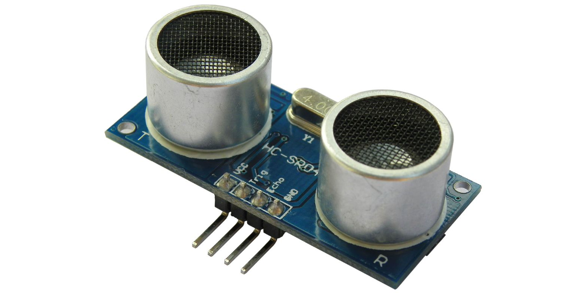
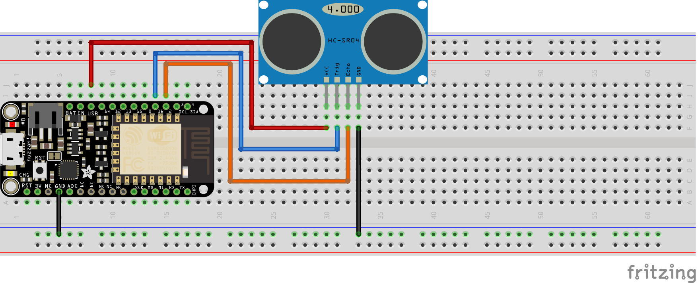

# Experiment 8: Ping Ping Ping and a Theremin[1](#myfootnote1)

### XP Summary

* Preliminaries - 15xp
* Theremin - 75xp

In this experiment we are going to examine a ping sensor. If you look closely at the picture below you will notice a *T*  on the lower left of the board and an *R* on the lower right. Those are labels on the silver cylinders. 

The *T* stands for ‘transmit’ and the *R*  stands for -- maybe you already guessed -- ‘receive’.  

##  Lightning. 
Maybe you heard that there is a way of calculating how far a lightning storm is from you based on the time between seeing a lightning bolt and hearing it. The number of seconds between seeing and hearing it divided by 5 is the number of miles away it is. If we count 1-mississippi, 2-mississippi, up to 10 - we know the storm is 2 miles away. We can do this because we know sound travels at 340 meters per second. You may have noticed that if you are high up in the stands of an arena, our vision of the drummer hitting the drums doesn't jive with what we hear. Anyway ....

So this sensor sends out a ultrasonic (sound) ping on the transmit then counts how long it takes that sound to be heard on the ‘receive’ end. So it emits a ping. That sound bounces off a wall, and gets ‘heard’ on the receive side.  Then, with our board we can determine how far away that wall is.

There are many uses of ping sensors, particularly in automobiles, including:

* adaptive cruise control
* blind spot detection
* vehicle detection for car wash
* people counting at event entrances
* robotic sensing

##  3 volts or 5 volts.
The particular ping sensor we are using is the extremely common HC-SR04. The HC-SR04 needs 5 volt input. Recall that our esp8266 board uses 3 volt logic. Fortunately, there is one pin (labeled **USB**) that provides 5 volt output. 
 

### Let's get started

## Preliminaries - 15xp
### Hardware Hookup

[link to larger picture](pics/ping_bb.png)

### NOTE: 
Because of the limits of the circuit drawing program I use, I show the wire connections in front of the sensor. It is better to place these behind the sensor so the wires don't interfere with the clean line-of-sight of the sensor.  Be sure that the TRIG sensor pin is connected to pin 2 and the ECHO pin to pin 16.

### The Code

 
    int  TRIGGER =  2;
    int ECHO    = 16;

    void setup() {
      Serial.begin (115200);
      pinMode(TRIGGER, OUTPUT);
      pinMode(ECHO, INPUT);  pinMode(BUILTIN_LED, OUTPUT);
    }

    void loop() {
      
      long duration, distance;
      digitalWrite(TRIGGER, LOW);  
      delayMicroseconds(2); 
      
      digitalWrite(TRIGGER, HIGH);
      delayMicroseconds(10); 
      
      digitalWrite(TRIGGER, LOW);
      duration = pulseIn(ECHO, HIGH);
      distance = (duration/2) / 29.1;
      
      Serial.print("Centimeter:  ");
      Serial.println(distance);
      delay(200);
    }        
### What You Should See 
When you first upload the code, open the serial monitor. You should see the distance between the sensor and an object (for example, your hand or a book).

## The Theremin.   75xp

Can you implement the device shown in [this video](https://photos.app.goo.gl/jpYbodynFQZNyFbT2)

### Some hints:

1. First, get the beats working -- just playing a single note while the range sensor is printing out the centimeter range.
2. Decide on the spatial range. For example, if the distance is over some amount don't play any notes.  Let's say your range is between 0 and 12 (this is a particularly bad pick -- don't use it)
2. Decide on the lowest note to play and the highest. Let's say, and here again this is a not a good pick, we pick between 100 and 212. 
3. Why am I using bad picks? Because I don't want you just to copy this, but to understand and do it for yourself. 
4. So now we need to map the range 0 to 12 to the range 100 to 212. This means that if our hand is 0 centimeters from the sensor we want to play frequency 100 and if our hand it at 12 centimeters we want to play frequency 212, and if our hand is midway (say 6 centimeters) we want to play 156. 
5. Hopefully, this will remind you of similar math problems. For example, converting Fahrenheit to Celsius. 
6. To figure out the formula, we need both scales starting at 0. The 100-212 scale does not. To get it starting at 0, we will subtract 100 (and remember that we subtracted that number). So now our frequency scale is 0-112
7. So now when our hand is at 0 centimeters our frequency scale is 0. That part is good. When our hand is 12 centimeters we need to have the frequency to be 112. So we need to multiply 12 by something.  How do we figure that?
8. We divide 112 by 12 which is about 9.3 so our formula is `frequency = 100 + distance * 9.3`  Let's see if that is right.
9. If the distance is 0 then the frequency is 100 -- so that is correct. And if the distance is 12 then the frequency is 100 + 12 * 9.3 or 211. So that is close enough! 
10. Hope that helps!

<a name="myfootnote1">1</a>: This  remix by Ron Zacharski

