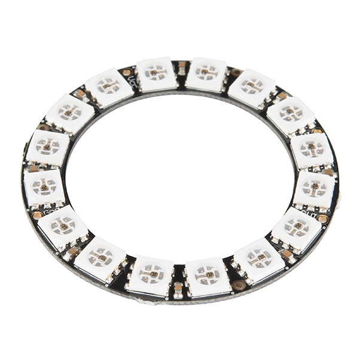
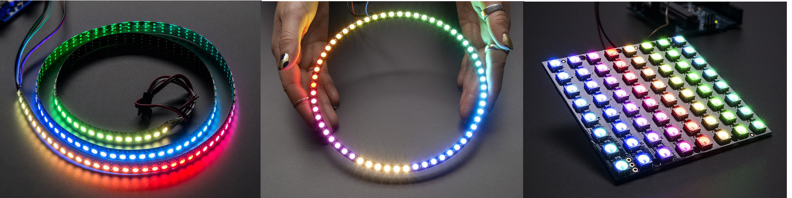
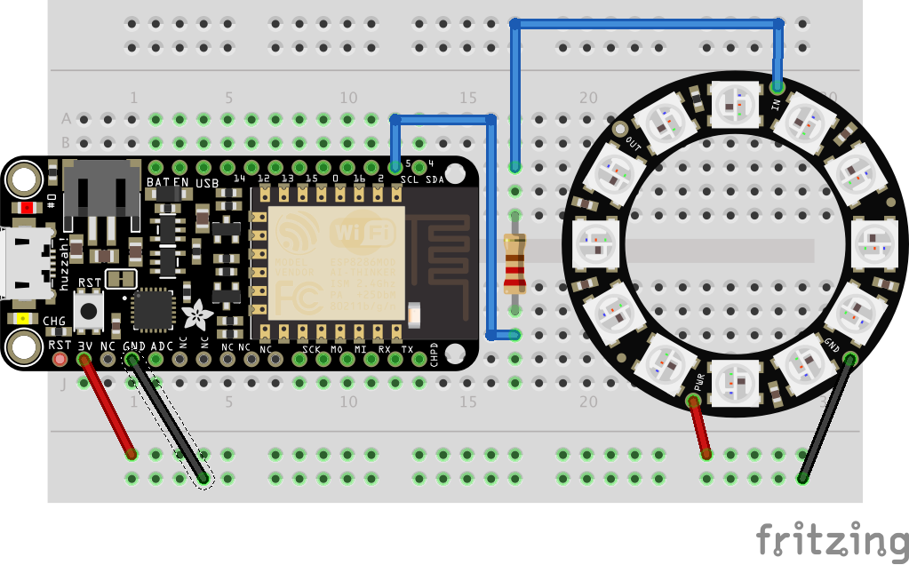
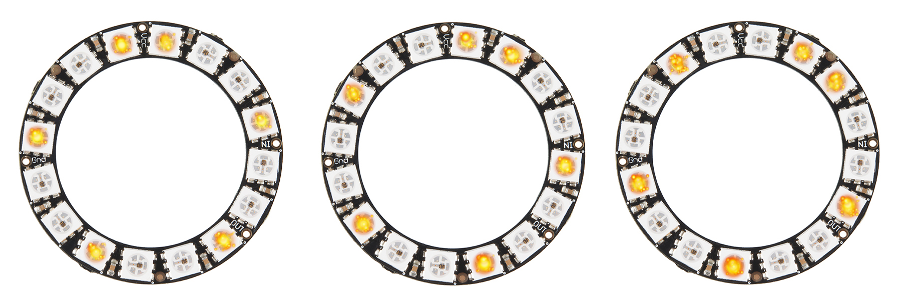

# Experiment 9: NeoPixel[1](#myfootnote1)

The above is a picture of the neopixel we will be using.  NeoPixels come in a variety of shapes and sizes:

 

Each NeoPixel contains a number of multicolor LED lights -- each of which is called a **pixel**. The collection of pixels on a NeoPixel is called a **strip**. This terminology will become important when we start coding.

## Step 1 Soldering

The first thing you need to do is solder wires to your NeoPixel. You will be connecting wires to the Ground, Power 5v, and the Data In connectors. We will help you with this.

## Step 2 Hardware Hookup

[link to larger picture](pics/neopixelSmall_bb.png)

## Step 3 The Basic Code

First you need to add the Adafruit NeoPixel library. We've added libraries before so we won't give you the details here. If you need a hint [click here](#hint)

Here is the basic code:

    #include <Adafruit_NeoPixel.h>

    #define PIN 5

    // Parameter 1 = number of pixels in strip
    // Parameter 2 = Arduino pin number (most are valid)
    // Parameter 3 = pixel type flags, add together as needed:

    Adafruit_NeoPixel strip = Adafruit_NeoPixel(16, PIN, NEO_GRB + NEO_KHZ800);

    // IMPORTANT: To reduce NeoPixel burnout risk, add 300 - 500 Ohm resistor on first pixel's data input
    // and minimize distance between Arduino and first pixel.  
    // Avoid connecting on a live circuit...if you must, connect GND first.

    void setup() {
      strip.begin();
      strip.show(); // Initialize all pixels to 'off'
    }

    void loop() {
      // Some example procedures showing how to display to the pixels:
      colorWipe(strip.Color(255, 0, 0), 50); // Red
      colorWipe(strip.Color(0, 255, 0), 50); // Green
      colorWipe(strip.Color(0, 0, 255), 50); // Blue
    }

    // Fill the dots one after the other with a color
    void colorWipe(uint32_t c, uint8_t wait) {
      for(uint16_t i=0; i<strip.numPixels(); i++) {
        strip.setPixelColor(i, c);
        strip.show();
        delay(wait);
      }
    }

Running this code should give you a cool effect.

## READ THIS. Some important lines in the above.
We have worked with a multicolor LED before. This one works differently. Here is the scoop. As with our original multicolor work, we specify values for red, green, and blue, but this time **0 means no color and 255 is the max color.**  To turn a particular pixel, a particular color is a 2 step process: first we must create the color using

	strip.Color(r, g, b)
	
where `r, g, b` are integers between 0 and 255 indicating the intensity of the red, green, and blue components, respectively. So, if we wanted to create the color red we would do

	strip.Color(255, 0, 0)

and if we wanted blue:

	strip.Color(0, 0, 255)

and if we wanted purple we might do:

	strip.Color(150, 0, 150)

Now we can set a particular pixel to a particular color using 

	strip.setPixelColor(i, c);

where `i` is the number of the pixel and `c` is a color.  So if we want to set the first pixel to red we would do:

	strip.setPixelColor(0, strip.Color(255, 0, 0));

and if we wanted to set the next pixel to blue we would do

	strip.setPixelColor(1, strip.Color(0, 0, 255));

This command doesn't actually turn on the pixel, which might seem screwy. It works like this. Suppose we have 16 people each with a variety of colored huge poster boards.  We go down the line of people saying things like  *Person 1 -- when I say show, you hold up the red board, Person 2, the blue board * and so on. We've instructed everyone what they are going to do and then we say:

        strip.show();
        delay(wait);
 
and those people hold up those boards. It's the same with these lights.

## Remix 1. ExtraWipes (easy) - 10xp
Can you modify the loop function so it wipes red, then wipes violet, then wipes blue, then wipes violet.

## Remix 2. Red and Blue Passing in the Night (medium) 20xp. 
Can you create a function:

     void redBluePassing(int wait){
     }

which changes the pixels from red to blue and back again. To test, change the loop function to:

     void loop() {
             redBluePassing(20);
     }

It should look like [this video](https://photos.app.goo.gl/rt5zhSEB3yipskgG2) Sorry for the poor quality.

## Remix 3.  TheaterChase (hard) - 35xp.  
We are going to write a function that initially looks like:

	void theaterChase(uint32_t c, uint8_t wait) {
	
     }

The argument `c` is the color, and `wait` is the wait time.
We are going to code that function in steps.

#### Step 1. blink every third light.
write two loops in `theaterChase` that will blink every third light on and then off for the `wait` time.  One loop turns every third pixel on. Outside the loop we will

	      strip.show();
	      delay(wait);

Then we will have another loop that turns them off and then after the loop, shows and delays.

For testing, replace the loop function with this one:

    void loop() {
      theaterChase(strip.Color(127, 127, 127), 500); // White
      theaterChase(strip.Color(127, 0, 0), 500); // Red
      theaterChase(strip.Color(0, 0, 127), 500); // Blue
    }

It should look like [this video](https://photos.app.goo.gl/On72RteWSGF14Mhp2)

Notice that 2 adjacent pixels blink -- that's fine.

#### Step 2. blink every third light 10 times
Okay. So now inside the function `theaterChase` you have 2 loops. One loop turns on every third led, the other loop turns them off. Enclose those two loops (as a unit) inside a larger loop that repeats the blinking ten times. It should look like:

It should look like [this video](https://photos.app.goo.gl/Wy3PCZJp5KWIclOY2)

#### Step 3. The challenging bit.
To illustrate this part let's make a little table explaining what we did.

step | 0 | 1 | 2 | 3 | 4 | 5 | 6 | 7 | 8 | 9 | 10 | 11 | 12 | 13 | 14 | 15
:--: |   :--: |     :--: |    :--: |    :--: |    :--: |    :--: |    :--: |    :--: |    :--: |    :--: |    :--: |    :--: |    :--: |    :--: |    :--: |    :--: | 
1 | * | | | * | | | *| | | *| | | *| | | *

Here we've number the lights 0 through 15 and we indicate which lights we are blinking with asterisks. And we repeat this one step 10 times. What we want to do is repeat 3 steps, 10 times. That is, step 1, step 2, step 3, step 1, step 2, step3 and so on. And we want the steps to look like:

step | 0 | 1 | 2 | 3 | 4 | 5 | 6 | 7 | 8 | 9 | 10 | 11 | 12 | 13 | 14 | 15
:--: |   :--: |     :--: |    :--: |    :--: |    :--: |    :--: |    :--: |    :--: |    :--: |    :--: |    :--: |    :--: |    :--: |    :--: |    :--: |    :--: | 
1 | * | | | * | | | *| | | *| | | *| | | *
2 | *  | * | | | * | | | *| | | *| | | *| | 
3 | | * |* | | | * | | | *| | | *| | | *| | 

or the same idea represented by a picture.

Our code from the previous step looked something like

	repeat 10 times:
	     for every third pixel:
	          turn it on
	          end for loop
	     strip show
	     delay
	     for every third pixel:
	          turn it on
	          end for loop
	     strip show
	     delay
	     end repeat

Let's alter this in substeps.

#### substep 1

Between the repeat and for add a loop three times line. For example:

    repeat 10 times:
      for p = 0, 1, and 2:
         for every third pixel:
              turn it on
              end for loop
         strip show
         delay
         for every third pixel:
              turn it on
              end for loop
         strip show
         delay
         end for p 
      end repeat 10 times

Note that we added a `for` loop but didn't do anything substantive yet.

#### substep 2
Remove the 

         strip show
         delay
 
lines just before the end of the `for p` loop. 

#### substep 3

Change the 500s in the loop function to 50s:

    void loop() {
      theaterChase(strip.Color(127, 127, 127), 50); // White
      theaterChase(strip.Color(127, 0, 0), 50); // Red
      theaterChase(strip.Color(0, 0, 127), 50); // Blue
    }
    
#### substep 4	
In the turning pixels on loop you probably have something like:

		strip.setPixelColor(i, c); 

and something similar in the turn off loop  Add plus `p` to both lines:

          strip.setPixelColor(i+p, c); 
          
#### substep 5 Test your code.  It should be awesome

#### substep 6 Add more colors.  It should be most awesome
Add at least 3 more `theaterChase` lines to the loop function to display different colors.

### Remix 4. Red and Blue Chasing Each Other in the Night  (medium) - 20xp
For this remix we are going to combine your red and blue passing in the night function with the `theaterChase` one. Let's call it:

	void redAndBlueChasing(int wait){
	}

So we want a chase pattern but the pixels will gradually change from red to blue and back again. It's easier than you'd think! Seriously, it is -- don't laugh.

Recall that in `theaterChase` the outer loop repeated the chase 10 times.  To convert the function to go red to blue is pretty easy. You are going to change the outer loop to repeat 256 times -- from 0 to 255 and then use the loop variable to set the color of the pixels. Easy peasy. 

##### now you have code that chases from red to blue
To go back again (from blue to red) here is what you do. Let's call that big blog of code that repeats 256 times (including the first line with the for loop to the } ending the loop), **the big for loop that repeats 256 times**. Let's copy **the big for loop that repeats 256 times** and paste it immediately after  **the big for loop that repeats 256 times**. Now we have 2 **the big for loop that repeats 256 times** -- one right after the other. In the second one you need to change a line so it goes blue to red.

### Remix 4. (fun) - 10xp
Here is a new loop function:

		void loop() {
		  colorWipe(strip.Color(255, 0, 0), 50); // Red
		  colorWipe(strip.Color(0, 255, 0), 50); // Green
		  colorWipe(strip.Color(0, 0, 255), 50); // Blue
		  redBluePassing(20);
		  redBluePassing(20);
		  // Send a theater pixel chase in...
		  theaterChase(strip.Color(127, 127, 127), 50); // White
		  theaterChase(strip.Color(127, 0, 0), 50); // Red
		  theaterChase(strip.Color(0, 0, 127), 50); // Blue
		  redAndBlueChasing(50)
		} 

As you can see it combines everything you already did to create an awesome demo of your 1337 programming skills. Just copy and paste your code from the previous remixes to create one demo file.

	     
<a name="hint">1</a>: Under the sketch menu select `Include Library` and then select `Manage Library`. Then, seach for Adafruit Neopixel and install it.